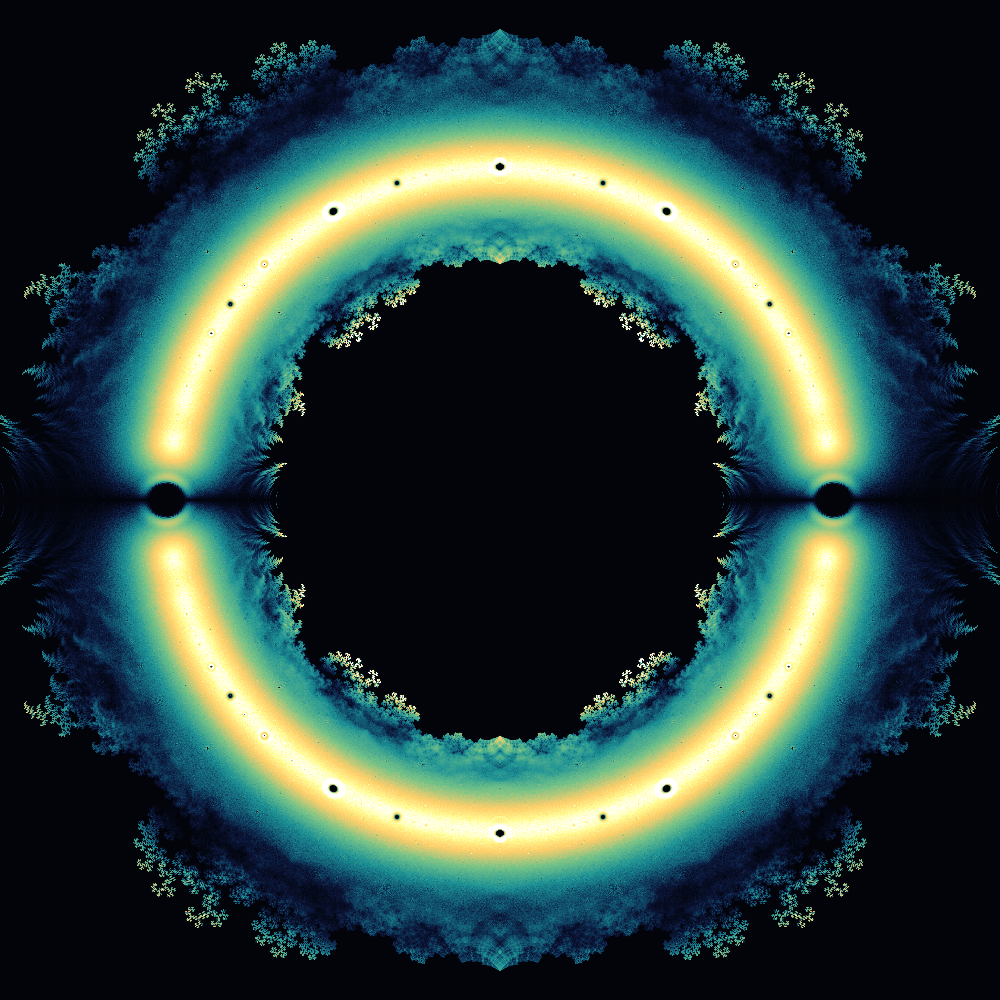
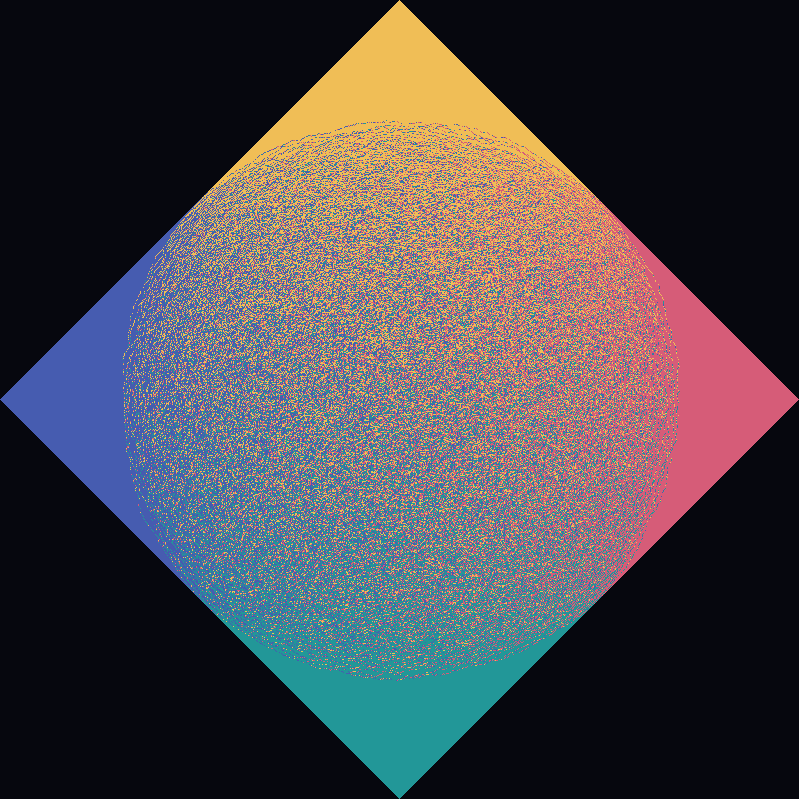
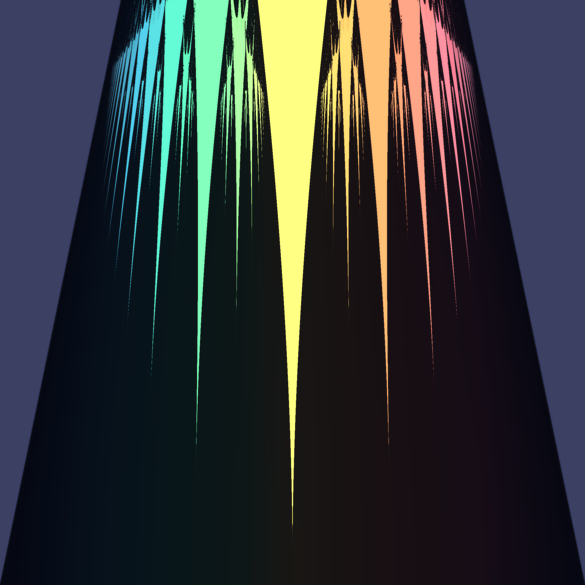

# The Frozen and the Free

*A procedural triptych. Three systems, three visual grammars, one thread: in
each, a **locked / determined** order and a **free / disordered** flux share the
same space — and the boundary between them, again and again, is drawn by the
**rational numbers**.*

Seeded by the live front pages of MathOverflow ("Density of good approximations
of irrational torus rotations"; "$p$-adic valuation of $\prod_k \Phi_q(k)$" —
cyclotomics / roots of unity; "Apophatic mathematics") and Philosophy.SE ("Are
we dead almost everywhere?"; "If there is no randomness, what is freedom?"; "Why
do philosophers restrict the realm of the possible?").

All three are honest computations — no hand-drawing. The first measures every
root of every sign-polynomial; the second draws a perfectly uniform random
tiling; the third measures a winding number a hundred million times.

---

## 01 · `01_forbidden_roots` — the holes the rationals burn  (4096² centerpiece)

Take **every polynomial of degree 24 whose coefficients are all ±1** — there are
2²⁴ ≈ **16.8 million** of them — and plot **all of their roots** in the complex
plane (≈ 400 million points), accumulating density by anti-aliased bilinear
splatting.

The roots crowd into a luminous annulus hugging the unit circle, fringed by a
**dragon-curve filigree** that is genuinely fractal (it rewards 4096²). But the
subject of the piece is what is **missing**: the black **holes punched at the
roots of unity** — a great void at $z=\pm1$, smaller eyes at the 6th, 8th, …
roots — each ringed by a bright halo where roots pile up against a region they
**cannot enter**. A ±1 polynomial near a root of unity would need its terms to
conspire, and they almost never can. The forbidden zones *are* the structure
(the "apophatic" thread: the object defined by where it is not).

The whole figure carries the symmetries of its alphabet: $z\!\to\!\bar z$,
$z\!\to\!-z$, and $z\!\to\!1/z$ (reverse the coefficient string), so it is
mirror-symmetric four ways and inverts through the unit circle.

*Density is histogram-equalized so the structure reads at every scale at once —
the gold unit-circle ridge, the teal annulus, the pale filigree, and the
halo-ringed voids.*

---

## 02 · `02_arctic_circle` — frozen corners, a free heart  (2048²)

A **uniformly random domino tiling of the Aztec diamond of order 1024**, sampled
exactly by the Elkies–Kuperberg–Larsen–Propp **domino-shuffling** algorithm
(delete colliding pairs → slide → fill empty 2×2 blocks by a fair coin), each of
the four domino orientations given its own colour.

The **Arctic Circle theorem** appears unbidden: outside the inscribed circle
(radius $N/\sqrt2$) the tiling is **frozen** — each of the four corners is forced
into a single brick pattern, a solid crystalline plate. Inside, the **temperate**
region is a free, disordered shimmer of all four types at once. A sharp circle
divides the determined from the free. The pure-colour corners against the muddy
centre *are* the dichotomy; the circle's crispness is its own proof that the
sampler is uniform.

---

## 03 · `03_arnold_tongues` — resonance, and the measure-zero free  (2048²)

The **sine circle map** $x \mapsto x + \Omega - \tfrac{K}{2\pi}\sin 2\pi x$, the
simplest model of a driven oscillator. For each point of the parameter plane
($\Omega$ = drive, $K$ = coupling) we **measure the rotation number** $W$ — the
average turns per step — by iterating six thousand times.

Where $W$ locks to a **rational** $p/q$ it stays locked over a whole wedge of
parameters: a **resonance tongue** (here brightened; flat $W$ ⇒ small $|\nabla W|$
⇒ "frozen"). Where $W$ stays **irrational** the motion is quasiperiodic and free
(the dim sea). The tongues hang from every rational in **Stern–Brocot / Farey**
order — gold $1/2$ at the heart, the cascade $1/3, 2/5, 3/8,\dots$ flanking it,
$0/1$ and $1/1$ receding into the void at the edges.

As the coupling $K$ climbs toward the critical line $K=1$, the frozen tongues
widen until they swallow **almost the entire line** — the *complete devil's
staircase*. What survives, the still-free quasiperiodic set, has **measure
zero**. *Are we dead almost everywhere?* Here, at criticality, the free is
exactly the dust between the tongues.

---

### Colophon
Pure Python + NumPy/SciPy/Pillow. Dark field, additive/equalized tone maps,
restrained bloom. Each piece is a measurement, not a drawing — the image is
where the arithmetic already was.
