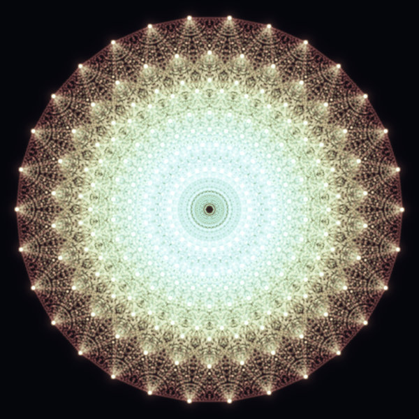

# E₈ — the 240-Root Mandala

The root system of **E₈**, the largest exceptional Lie group (dimension 248),
projected onto its Coxeter plane — the single 2-plane in which its symmetry
spreads most evenly. E₈ has **240 roots** in eight-dimensional space; here they
land in **8 perfect rings of 30** (30 is E₈'s Coxeter number), and the **6,720
lines** join every pair of roots that meet at 60°. It is the most famous picture
in Lie theory, and it is the far corner of the Freudenthal magic square — where
the octonions meet the octonions.

## The animation

The mandala has 30-fold rotational symmetry, so a rotation of just **12°** (2π/30)
returns it exactly to itself — which makes the spin a seamless, endless loop.
Watch the eight rings turn as one rigid, eight-dimensional jewel seen edge-on.

---

*Verified in `e8.py`: 240 roots all of norm² 2, the Coxeter element has order 30,
and the projection sorts the roots into 8 rings of 30. Rendered with a batched
additive-glow rasteriser (`mandala.py`).*
