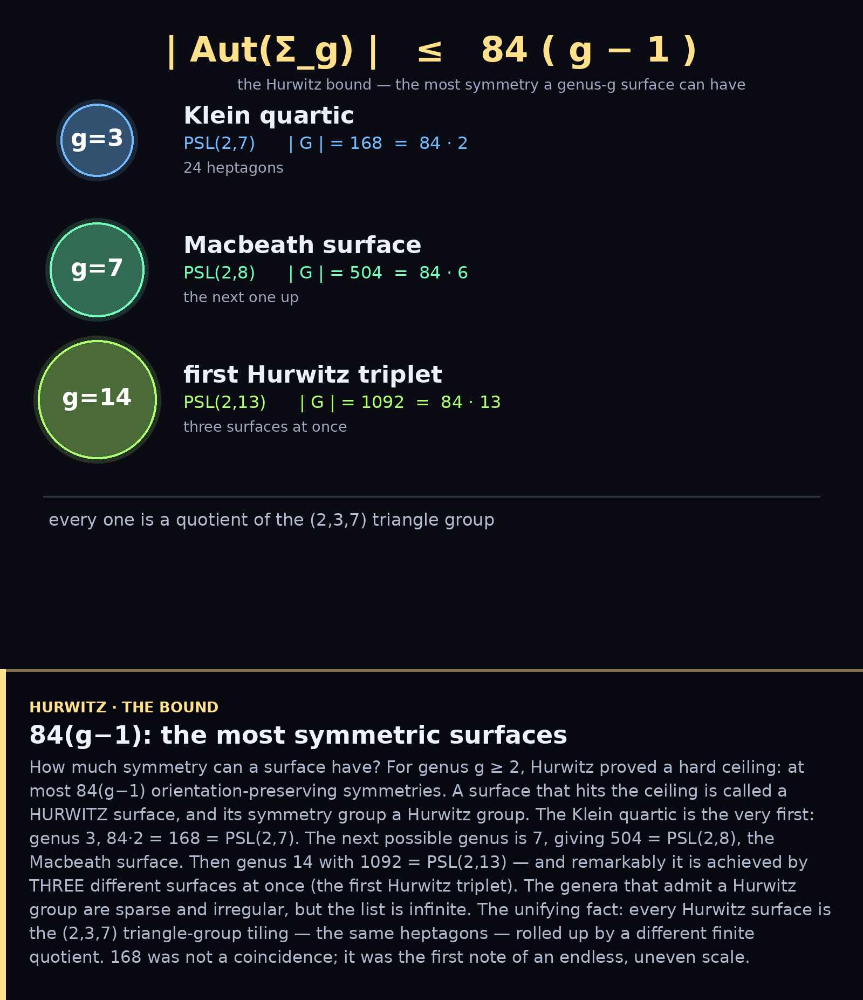
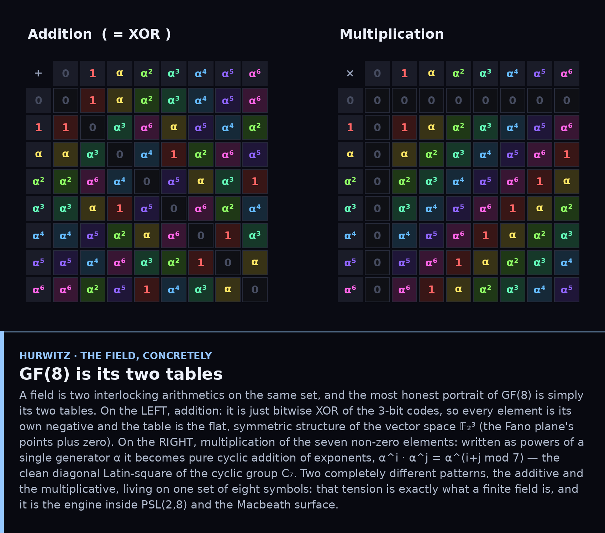

# The Hurwitz Chain — beyond the Klein Quartic

*Why 168 was special, and the endless, uneven scale that follows it.*

## 1. The bound 84(g−1)

A closed surface of genus g ≥ 2 can have at most **84(g−1)** orientation-preserving
symmetries — Hurwitz's theorem. A surface that achieves the maximum is a
**Hurwitz surface**. The Klein quartic is the first: genus 3, 84·2 = **168** =
PSL(2,7). The next is genus 7, **504** = PSL(2,8) (the Macbeath surface), then
genus 14, **1092** = PSL(2,13) — achieved by *three* surfaces at once, the first
Hurwitz triplet. The admissible genera are sparse and irregular, but the list
goes on forever. Every Hurwitz surface is the **(2,3,7) triangle-group tiling** —
the same heptagons as the Klein quartic — rolled up by a different finite
quotient.

## 2. GF(8): the field whose heart is the Fano plane

The Macbeath group PSL(2,8) is built from the field of 8 elements,
GF(8) = 𝔽₂[x]/(x³+x+1) — and that field is the Fano plane in disguise. Its eight
elements under addition (XOR of 3-bit strings) are exactly **𝔽₂³**, the Fano
points plus zero (the gold lines are the XOR-triples). Its seven non-zero
elements under multiplication are the cyclic group **C₇**: powers of a single
primitive element α, the Singer cycle (blue ring) that rotated the Fano plane in
the very first PSL(2,7) figure. One finite field holds both the additive
geometry of the Fano plane and its multiplicative symmetry. PSL(2,8) then acts on
the 9 points of ℙ¹(GF(8)) with order 8·9·7 = **504** = 84·6.

## 3. GF(8), concretely — its two tables

The most honest portrait of a field is simply its two arithmetics. **Addition**
in GF(8) is bitwise XOR — flat, symmetric, every element its own negative (the
vector space 𝔽₂³). **Multiplication** of the seven non-zero elements, written as
powers of a generator α, becomes pure cyclic addition of exponents
(α^i · α^j = α^(i+j mod 7)) — the clean diagonal Latin square of C₇. Two utterly
different patterns on one set of eight symbols: that tension *is* the field, and
it is the engine inside PSL(2,8).

---

The Klein quartic is not a lonely miracle but the opening note of an infinite
theme: the most-symmetric-possible surfaces, all cut from the same hyperbolic
cloth — the (2,3,7) triangles — and all governed by simple groups of
Lie type over finite fields.

### Files
`fig1_chain.py`, `fig2_gf8.py` (GF(8) arithmetic included).
