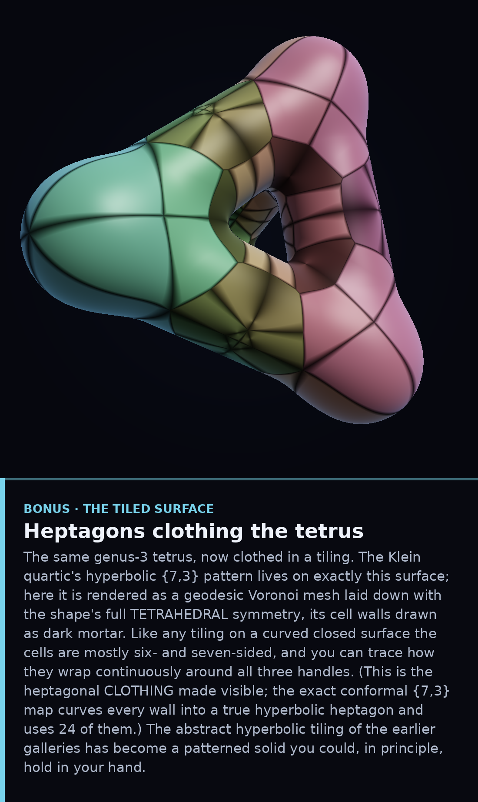

# The Klein Quartic, Embodied — the Tetrus


In the `psl168/` gallery the Klein quartic appeared as a *tiling* in the
hyperbolic disk. Here it gets a body in ordinary 3-space.

Topologically the Klein quartic is a **genus-3** surface — a sphere with three
handles. The most natural way to realise one with the curve's **tetrahedral**
symmetry is to take the wire frame of a tetrahedron (4 corners, 6 struts) and
thicken it into smooth tubes. The genus follows from a graph count: fattening a
graph with `V` vertices and `E` edges gives a surface of genus `E − V + 1`, and
for the tetrahedron that is `6 − 4 + 1 = 3`. This shape is often called the
**tetrus**.

It matches the combinatorics of the `{7,3}` tiling exactly. The Klein quartic is
tiled by **24 heptagons**, with **56 vertices** and **84 edges**, so its Euler
characteristic is

```
χ = V − E + F = 56 − 84 + 24 = −4 = 2 − 2g   ⇒   g = 3.
```

Wrap those 24 heptagons onto the tetrus and they close up seamlessly, carrying
all **168** of the quartic's rotational symmetries — the maximum a genus-3
surface can possess (Hurwitz's bound 84(g−1) = 168).

*Rendered by sphere-tracing a signed-distance field — the image is computed
directly from the equation "distance to the tetrahedral frame", with no polygon
mesh. Lighting is diffuse + specular + a rim/fresnel term; colour runs teal→gold
along the tetrahedral axis.*

## Clothed in heptagons



And here is the surface wearing the tiling. The Klein quartic's `{7,3}` pattern
lives on exactly this shape; this render lays it down as a geodesic Voronoi mesh
with the tetrus's full **tetrahedral symmetry**, cell walls drawn as dark mortar.
As on any curved closed surface the cells are mostly six- and seven-sided, and
you can trace them wrapping continuously around all three handles. (It is the
heptagonal *clothing* made visible; the exact conformal map curves every wall
into a true hyperbolic heptagon and uses 24 of them.) The hyperbolic tiling of
the earlier galleries has become a patterned solid.

### Files
`tetrus.py` — the SDF raymarcher · `tetrus_tiled.py` — the tiled version
(symmetry-orbit centers projected onto the surface + on-surface Voronoi).
