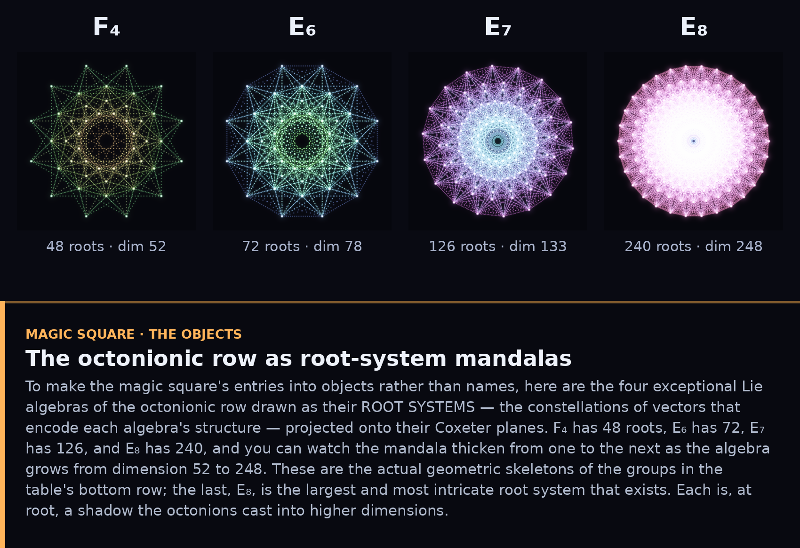
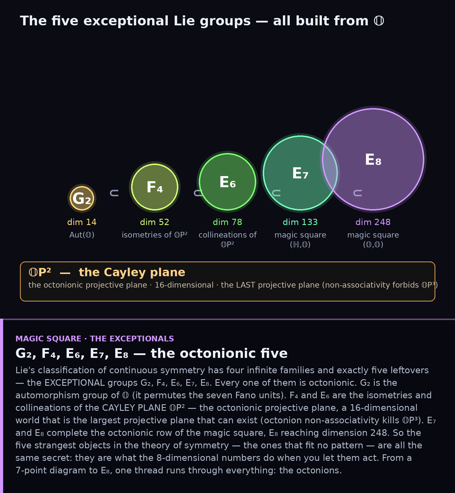

# The Magic Square and the Cayley Plane

*Where the octonions finish what they started: the exceptional Lie groups.*

## 1. The Freudenthal–Tits magic square

Index a 4×4 table by the four division algebras ℝ, ℂ, ℍ, 𝕆, feed each *pair*
into one uniform construction, and a Lie algebra comes out. The ordinary corners
give classical groups (orthogonal, unitary, symplectic). But the row and column
belonging to the **octonions** produce, in order, four of the five exceptional
Lie groups — **F₄, E₆, E₇**, and, where 𝕆 meets 𝕆, the magnificent **E₈** of
dimension 248. The dimensions are shown in each cell; the symmetry of the table
across its diagonal is part of the "magic."

## 1b. The entries as objects — root-system mandalas

A table of names is one thing; here are the table's bottom-row entries as actual
*objects*. Each exceptional Lie algebra is drawn as its **root system** — the
constellation of vectors that encodes its structure — projected onto its Coxeter
plane. Watch the mandala thicken from **F₄** (48 roots, dimension 52) through
**E₆** (72) and **E₇** (126) to **E₈** (240 roots, dimension 248), the largest
and most intricate root system that exists. These are the real geometric
skeletons sitting in the magic square's octonionic row.

## 2. The five exceptionals — all octonionic

Lie's classification has four infinite families and exactly five exceptions:
**G₂, F₄, E₆, E₇, E₈**. Every one is octonionic. G₂ is Aut(𝕆). F₄ and E₆ are the
isometries and collineations of the **Cayley plane 𝕆P²** — the octonionic
projective plane, a 16-dimensional space that is the *largest projective plane
that can exist* (non-associativity forbids 𝕆P³). E₇ and E₈ complete the
octonionic row of the magic square. The strangest, most pattern-defying objects
in the theory of continuous symmetry are all the same secret: they are what the
8-dimensional numbers do when you let them act.

---

## Full circle

We began with a 7-point diagram — the Fano plane, the octonion multiplication
table — and followed it through finite geometry, graph theory, hyperbolic
tilings, Riemann surfaces, simple groups, codes, designs, and sporadic groups.
It ends here, at E₈, the summit of Lie theory. One thread runs through all of it:
**the octonions**, the last place where you can still divide. Everything
exceptional in mathematics seems to gather around that one fact.

### Files
`fig1_square.py`, `fig2_exceptional.py`.
