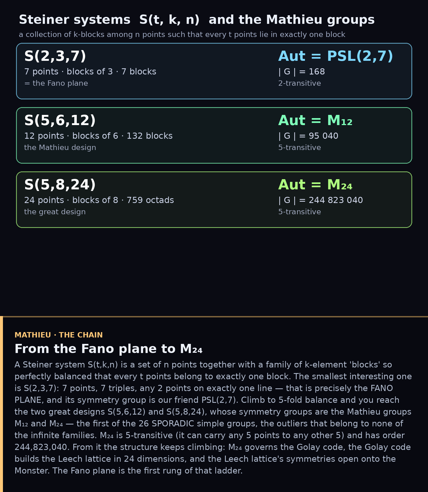
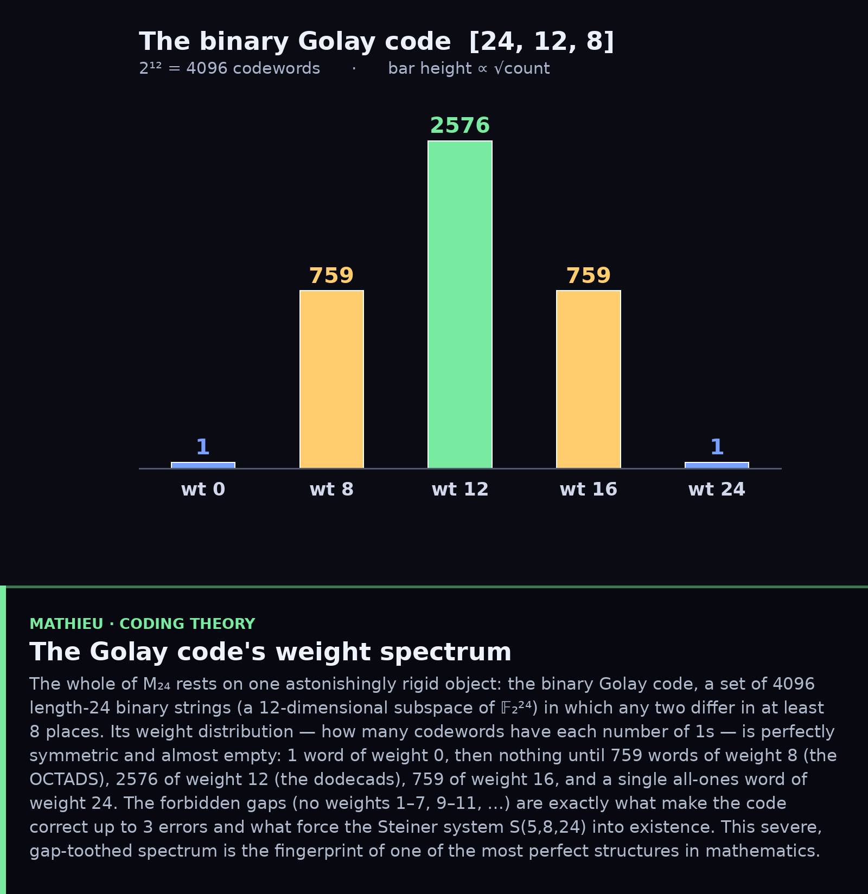
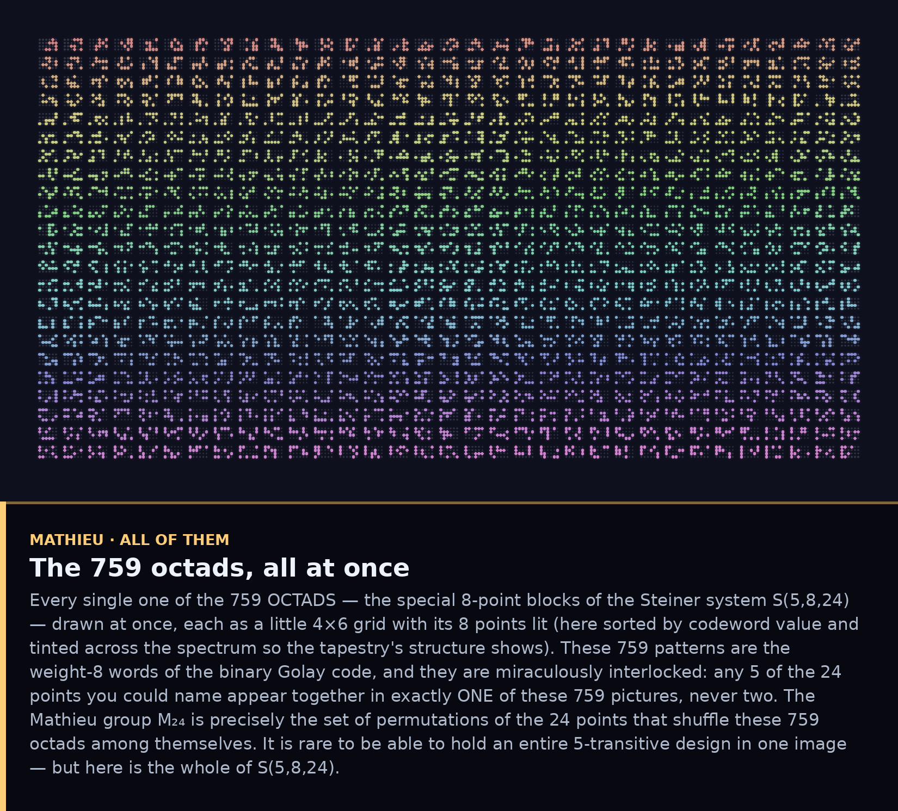

# The Mathieu Groups and the Steiner Systems

*The Fano plane was the smallest of a family. Here is its largest, most
miraculous sibling — and the door it opens onto the sporadic simple groups.*

## 1. From the Fano plane to M₂₄

A **Steiner system** S(t,k,n) is n points with a family of k-element *blocks* so
balanced that every t points lie in exactly one block. The smallest interesting
one is S(2,3,7) — 7 points, 7 triples, two points per line — which *is* the Fano
plane, with symmetry group PSL(2,7). Push to 5-fold balance and you reach the two
great designs S(5,6,12) and S(5,8,24), whose symmetry groups are the **Mathieu
groups** M₁₂ and M₂₄ — the first of the 26 **sporadic** simple groups, the ones
that fit no infinite family. M₂₄ is 5-transitive and has order 244,823,040.

## 2. S(5,8,24) — five points name an eight

Lay the 24 points in a 4×6 grid (Conway's *Miracle Octad Generator*). There are
**759 octads** — 8-point blocks — with the magic property that any 5 of the 24
points lie in exactly one octad. Five points determine a unique eight. The
symmetry group preserving this structure is M₂₄.

## 3. The Golay code — where the octads come from

The octads are exactly the weight-8 words of the **binary Golay code** [24,12,8]:
4096 binary strings, any two differing in ≥ 8 places. Its weight spectrum is
perfectly symmetric and full of forbidden gaps — **1, 759, 2576, 759, 1** at
weights 0, 8, 12, 16, 24 and nothing else. Those gaps are what make the code
correct 3 errors and what *force* S(5,8,24) to exist. (Built and verified in
`golay.py` from the [23,12] generator polynomial plus a parity bit.)

## 4. All 759 octads at once

And here they all are — every one of the 759 octads in a single tapestry, each a
4×6 glyph with its 8 points lit (sorted by codeword value, tinted across the
spectrum). Any 5 of the 24 points appear together in exactly one of these 759
pictures. M₂₄ is the group of permutations of the 24 points that merely shuffle
this collection among itself.

---

The ladder does not stop. M₂₄ governs the Golay code; the Golay code builds the
**Leech lattice** in 24 dimensions; the Leech lattice's symmetries (the Conway
groups) sit inside the **Monster**, the largest sporadic group — and the
Monster's character degrees are the coefficients of the modular j-function
(*monstrous moonshine*). The Fano plane we started with, S(2,3,7), is the first
rung of that impossible staircase.

### Files
`golay.py` — verified Golay code (weight dist 1,759,2576,759,1; S(5,8,24)
checked) · `fig1_chain.py`, `fig2_mog.py`, `fig3_weights.py`.
