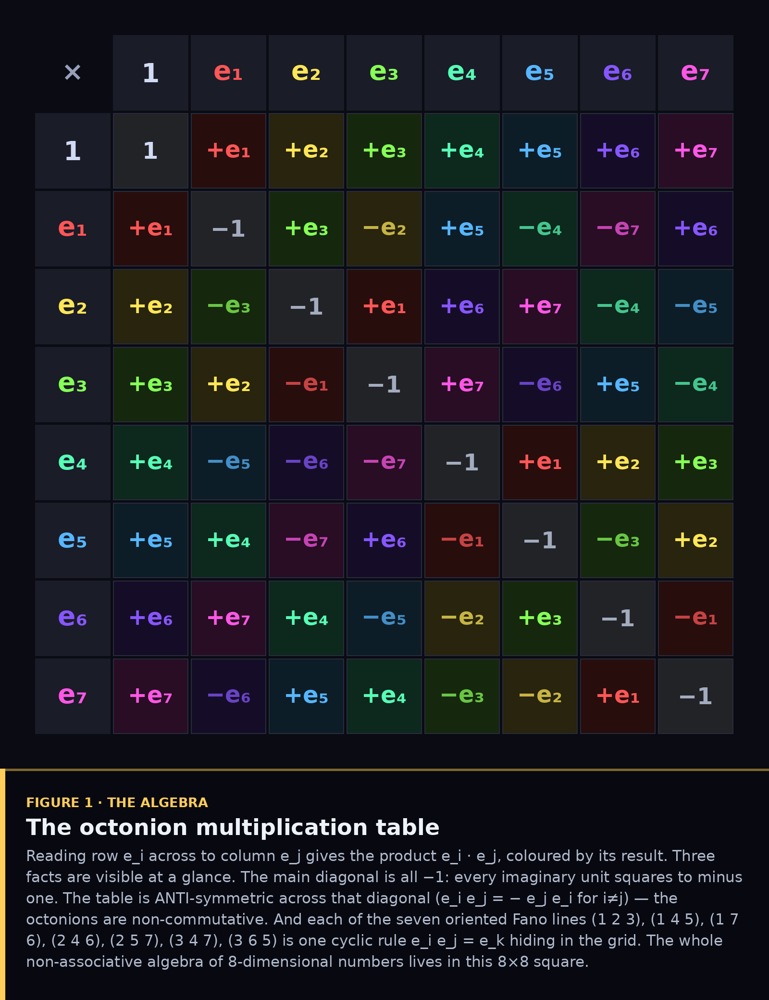
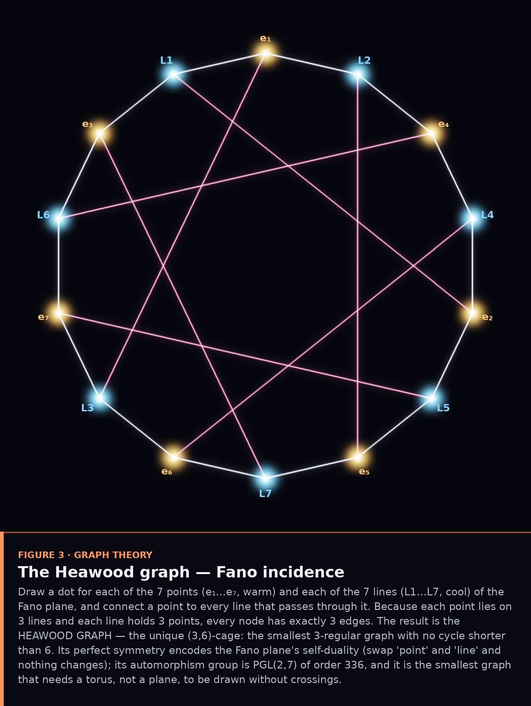
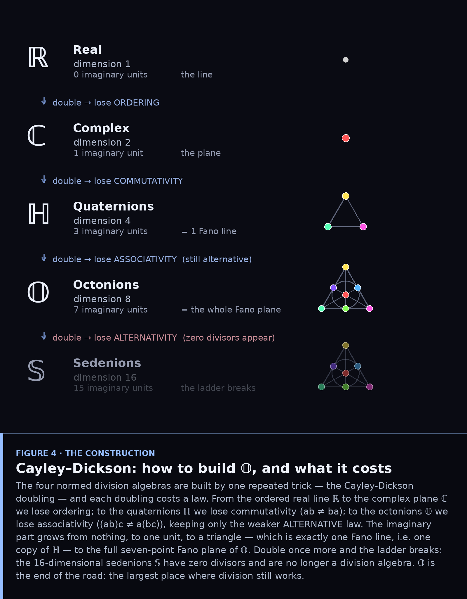
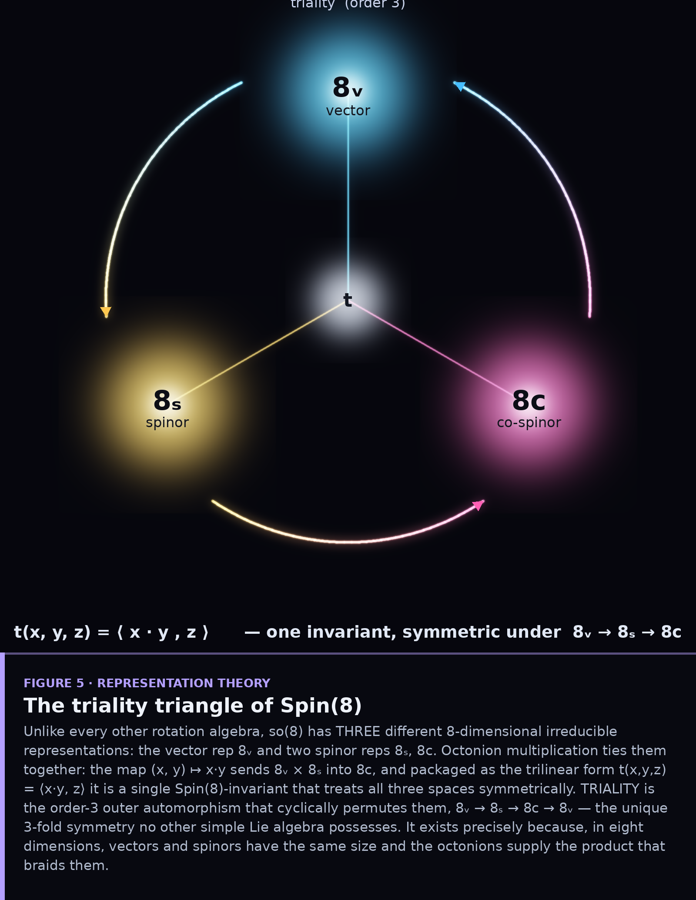
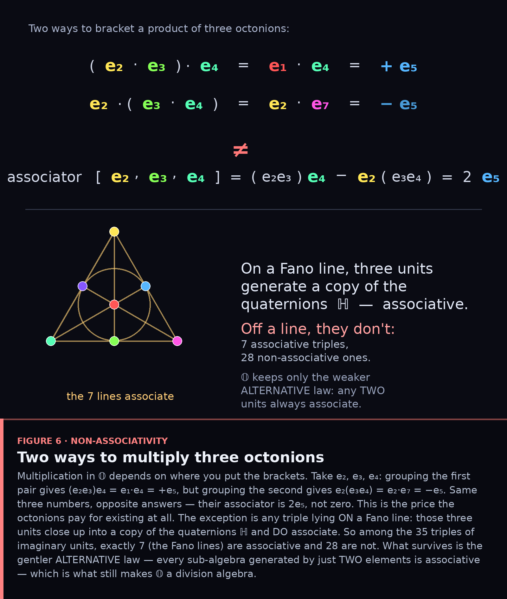
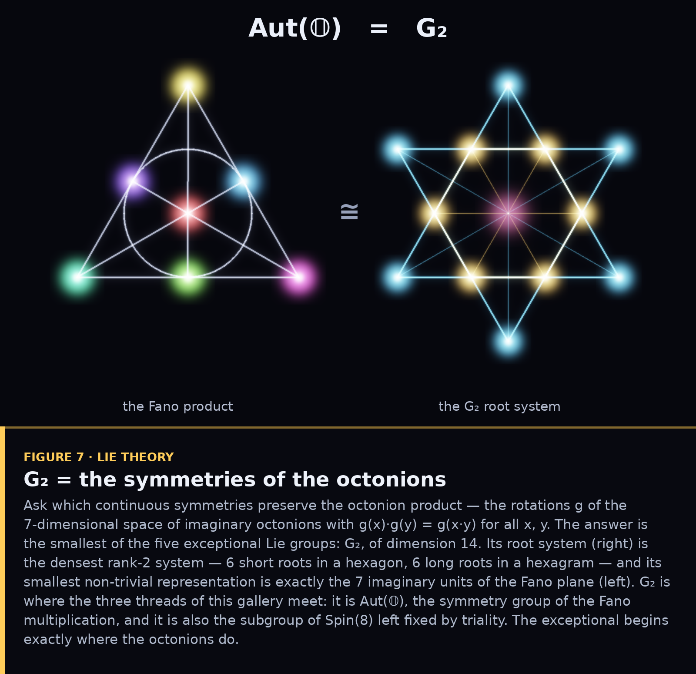

# Seven Lenses on the Octonions

*The Fano plane, the octonions, and triality — looked at from seven different
directions.*

These three objects are really one object wearing three masks. The **octonions**
𝕆 are the largest number system in which you can still divide; their
multiplication is encoded by the **Fano plane**, the smallest projective plane;
and the deepest symmetry in the neighbourhood — **triality**, the threefold
outer automorphism of Spin(8) — is what happens when you take the octonions
seriously as geometry.

A single picture flattens all of that into one viewpoint. So this is a *gallery
of viewpoints*: each figure attacks the same trio through a different branch of
mathematics, and each carries its own annotation block explaining what you are
looking at. Everything below was generated from a single verified implementation
of the octonion algebra (`octo.py` — checked for the composition law
|xy|=|x||y|, the alternative law, non-associativity, and the Fano/XOR
correspondence).

---

## 1. The algebra — a multiplication table

The bluntest way to meet the octonions: write down how the eight basis units
multiply. Three things jump out of the grid — the diagonal of −1 (every
imaginary unit squares to minus one), the anti-symmetry across that diagonal
(they don't commute), and the fact that the whole 8-dimensional algebra is
generated by just seven little cyclic rules. Those seven rules are the seven
lines of the Fano plane, which is where we go next.

## 2. Finite geometry — the Fano plane is a cube

Relabel the seven imaginary units by the binary digits of their indices and
something magical happens: they become the seven non-zero corners of a cube, the
points of the vector space **F₂³**. Multiplication collapses to a single line of
arithmetic — `eᵢ · eⱼ = eₖ` exactly when `i XOR j = k`. The Fano plane is just
the projective plane PG(2,2), and octonion multiplication is, at heart, addition
modulo 2 with a remembered sign.

## 3. Graph theory — the Heawood graph

Forget coordinates entirely and keep only *incidence*: which point lies on which
line. Seven points, seven lines, each point on three lines and each line through
three points. The resulting graph is the **Heawood graph**, the unique
(3,6)-cage — and its flawless symmetry is the Fano plane's self-duality made
visible. It is also the smallest graph that simply will not fit on a plane
without crossings; its natural home is the torus.

## 4. The construction — the Cayley–Dickson ladder

Where do the octonions even come from? From doubling. Starting at the real line,
one mechanical construction climbs ℝ → ℂ → ℍ → 𝕆, doubling the dimension each
time and paying for it by losing a law: first ordering, then commutativity, then
associativity. The imaginary part grows from nothing, to one unit, to a single
Fano line (the quaternions ℍ), to the whole Fano plane (𝕆). Double once more and
the structure shatters into zero divisors. 𝕆 is the last rung that still divides.

## 5. Representation theory — the triality triangle

Now the heart of it. The Lie algebra so(8) has **three** different
8-dimensional irreducible representations — a vector and two spinors — a
coincidence that happens in no other dimension. Octonion multiplication is
precisely the triality-symmetric form that couples all three. **Triality** is
the order-3 outer automorphism that rotates them into one another,
8ᵥ → 8ₛ → 8c → 8ᵥ: a symmetry not of points or vectors, but of the very
*kinds* of object the theory contains.

## 6. Non-associativity — two ways to multiply three things

Associativity is so familiar we forget it is a choice. The octonions decline it:
`(e₂e₃)e₄ = +e₅` while `e₂(e₃e₄) = −e₅` — same three units, opposite answers.
The exception is any triple lying on a Fano line, which closes into a copy of
the quaternions and behaves. Of the 35 triples of imaginary units, exactly seven
(the lines) associate and twenty-eight do not. What remains is the gentler
*alternative* law — and that is just enough to keep division alive.

## 7. Lie theory — G₂, where it all meets

Finally, ask which continuous symmetries preserve the octonion product. The
answer is **G₂**, the smallest of the exceptional Lie groups (dimension 14), and
its smallest representation is exactly the seven imaginary units of the Fano
plane. This is where the three threads knot together: G₂ is Aut(𝕆), the symmetry
group of the Fano multiplication — and it is *also* the part of Spin(8) left
fixed by triality. The exceptional world of mathematics begins exactly where the
octonions do.

---

## The shape of the whole thing

Read top to bottom, the seven figures tell one story. A multiplication table
(§1) is secretly a finite geometry (§2), which is secretly a graph (§3); that
algebra is built by a doubling ladder (§4) whose last good rung carries a
threefold symmetry (§5) bought at the price of associativity (§6) and guarded by
an exceptional group (§7). The Fano plane, the octonions, and triality are not
three subjects. They are one subject, and the only way to see it whole is to
keep walking around it.

### Files
`octo.py` — verified octonion algebra + Fano/F₂³ data ·
`figkit.py` — figure compositor (annotation blocks) ·
`fig1`–`fig7_*.py` — one script per figure.
