# The Anatomy of a Shuffle — a permutation-theory gallery

Twenty-one lenses on the symmetric group `Sₙ` (Volumes I–VI, including one
animation), each with its own visual grammar and each verified in code before it
is drawn. A permutation is the simplest possible
"mixing" of a finite set — and almost every deep structure in combinatorics is
hiding inside it. This gallery grew out of the main set's piece 05 (the
Vershik–Kerov limit shape of a random Young diagram); here we open up the object
that piece came from.

Build it: each `render_0N_*.py` is self-contained (`numpy`/`scipy`/`Pillow`),
sharing `figkit.py` (the caption blocks), `cycles.py` (cycle decomposition +
verified `H_n` / Golomb–Dickman statistics), and `sortnet.py` (a verified
reduced-word / wiring-diagram utility).

---

## 1 · The Cycles of a Random Permutation
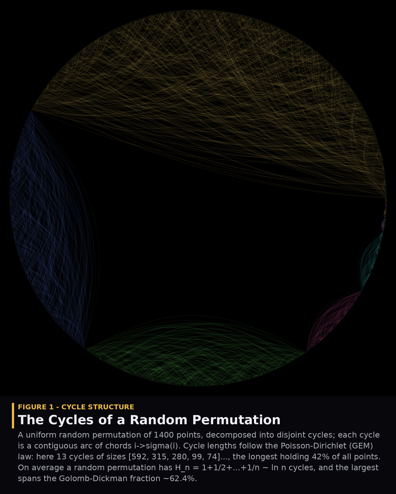

Every permutation is a disjoint union of cycles. Drawn here as chords `i→σ(i)`,
with each cycle grouped into its own arc, the **cycle-length partition** becomes
visible as the sizes of the woven lenses — and it follows the **Poisson–Dirichlet
(GEM)** law. A random permutation has on average `H_n = 1 + ½ + … + 1/n ≈ ln n`
cycles, and its **longest cycle** swallows the **Golomb–Dickman** fraction
≈ 62.4% of all points (verified by simulation: 0.618 vs 0.6243). The giant cycle
is the rule, not the exception.

## 2 · The Permutohedron
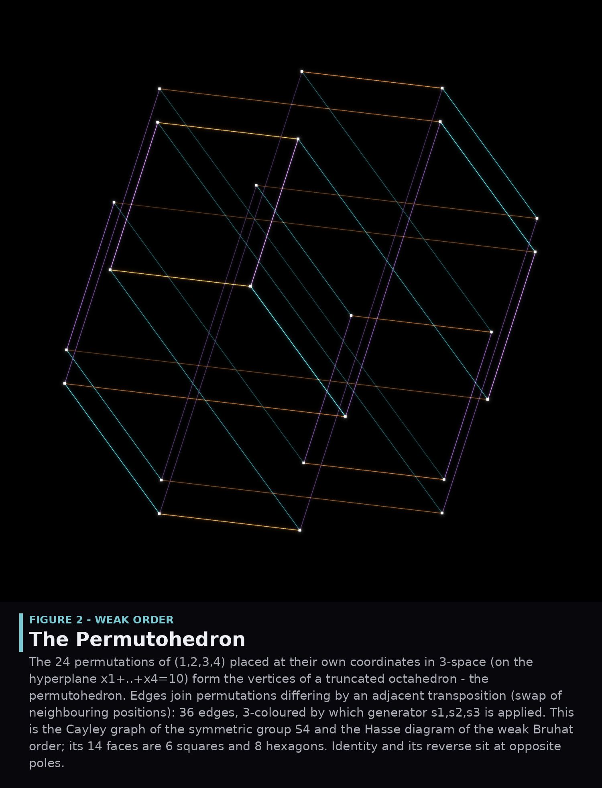

Place each of the 24 permutations of `(1,2,3,4)` at its own coordinate in
3-space: the vertices of a **truncated octahedron**. Edges join permutations that
differ by an **adjacent transposition** (a swap of neighbouring positions),
3-coloured by which generator `s₁,s₂,s₃` is used. This single object is at once
the **Cayley graph** of `S₄`, the **Hasse diagram of the weak Bruhat order**, and
a space-filling polytope (6 square + 8 hexagonal faces). The identity and the
full reversal sit at opposite poles, `(4 choose 2)=6` steps apart.

## 3 · RSK and the Longest Increasing Subsequence
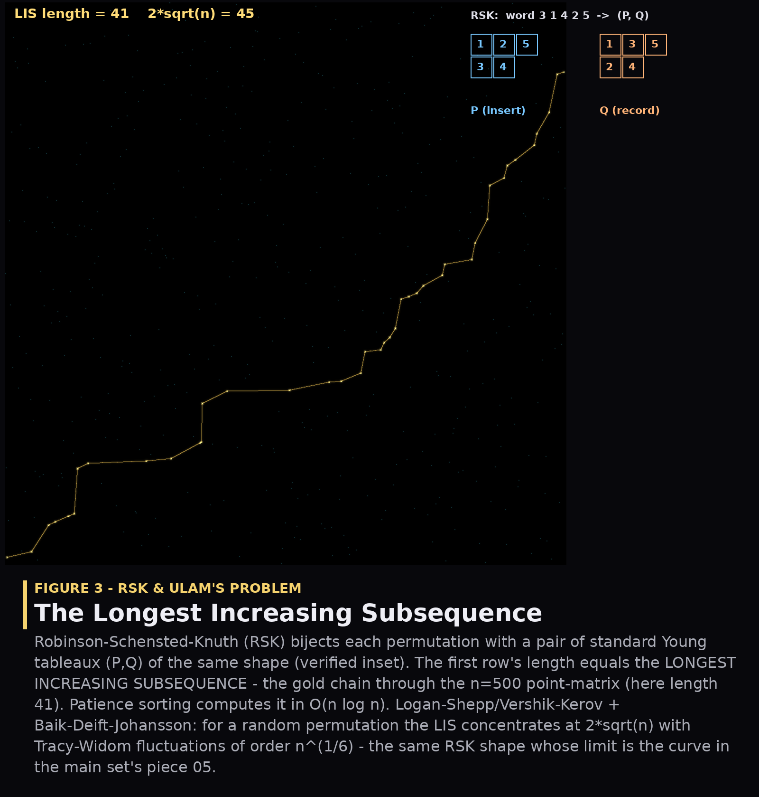

The **Robinson–Schensted–Knuth** correspondence bijects every permutation with a
pair of standard Young tableaux `(P, Q)` of the same shape (verified inset). The
length of the first row equals the **longest increasing subsequence** — the gold
chain climbing through the point-matrix — computable in `O(n log n)` by patience
sorting. **Ulam's problem**, answered by Logan–Shepp/Vershik–Kerov and
Baik–Deift–Johansson: for a random permutation the LIS concentrates at `2√n`,
with Tracy–Widom fluctuations of order `n^{1/6}`. The shape produced by RSK is
exactly the random Young diagram whose limit is piece 05 of the main set.

## 4 · Counting Disorder: the Mahonian Distribution
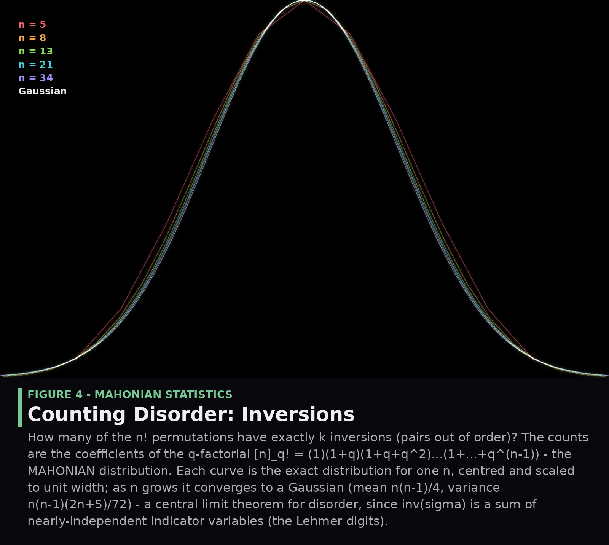

How many of the `n!` permutations have exactly `k` **inversions** (pairs out of
order)? The counts are the coefficients of the **q-factorial**
`[n]_q! = (1)(1+q)(1+q+q²)…(1+…+q^{n-1})` — MacMahon's *Mahonian* distribution.
Centred and scaled, the exact distributions march toward a **Gaussian** (mean
`n(n-1)/4`, variance `n(n-1)(2n+5)/72`): a central limit theorem for disorder,
because `inv(σ)` is a sum of nearly-independent digits (the Lehmer code).

## 5 · Order, Tuned by a Single Parameter — the Mallows Measure
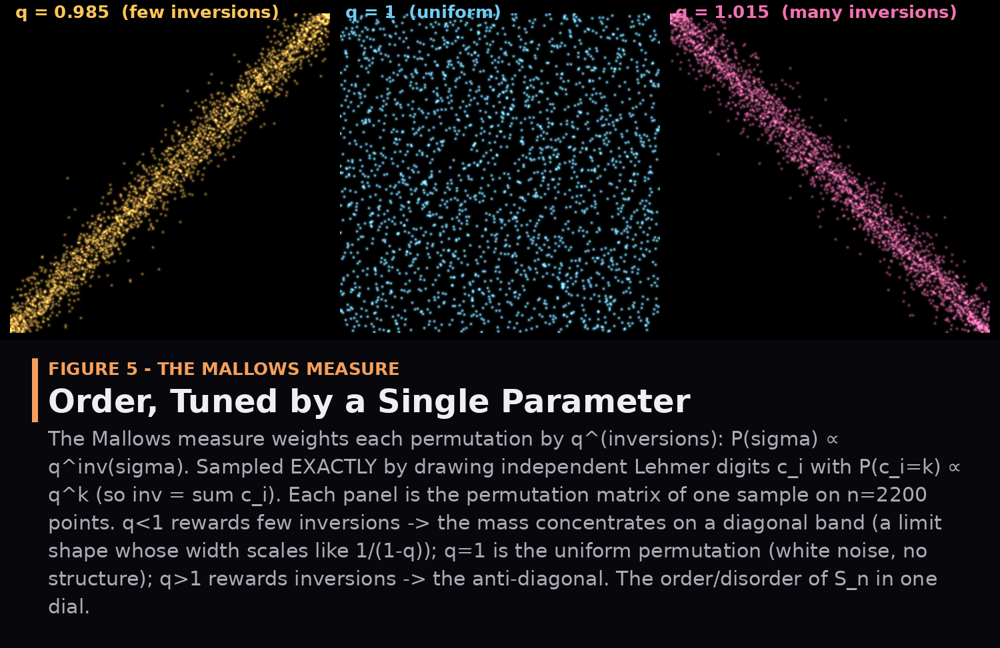

The **Mallows measure** weights each permutation by `q^{inv(σ)}`, sampled here
*exactly* by drawing independent geometric Lehmer digits. One dial `q` sweeps the
whole symmetric group from order to chaos and back: `q<1` rewards few inversions
and the permutation matrix collapses onto a **diagonal limit-shape band**; `q=1`
is the uniform permutation (structureless noise); `q>1` drives it to the
anti-diagonal. The same "frozen ↔ free" story as the main set's tilings, now over
`Sₙ`.

---

# Volume II — going deeper

## 6 · The Sine Curves of a Perfect Shuffle
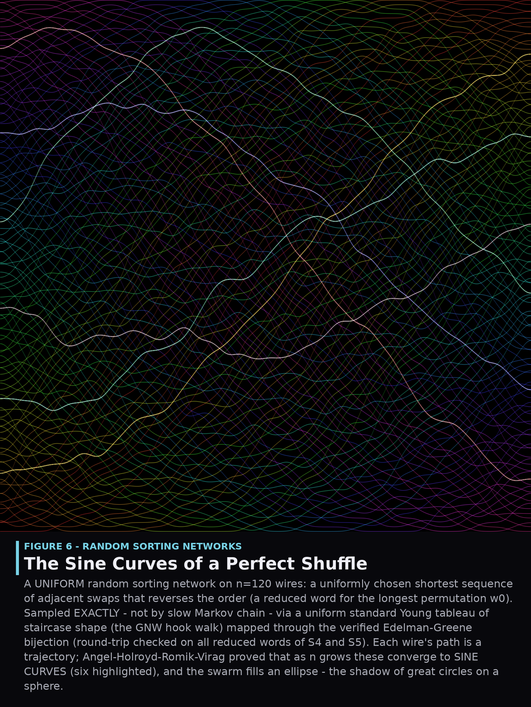

The piece the first volume deliberately left undone: a **uniform random sorting
network** — a uniformly chosen *shortest* sequence of adjacent swaps that reverses
`1,2,…,n` (a reduced word for the longest permutation `w₀`). Sampling one
*uniformly* is the hard part: the naive braid/commutation Markov chain mixes far
too slowly (even `n=30` stays visibly biased after 30M moves). The honest route,
built here, is exact: sample a **uniform standard Young tableau of staircase
shape** (the Greene–Nijenhuis–Wilf hook walk), then map it through the
**Edelman–Greene bijection** to a reduced word — with the bijection's forward and
inverse *round-trip verified on every reduced word of `S₄` and `S₅`* (0
mismatches), and the inverse's special-case rule (trigger iff the bumped value is
already present in the row) derived and checked by hand.

Each wire's path is a trajectory. **Angel–Holroyd–Romik–Virág** proved that as
`n→∞` these converge to **sine curves** (six highlighted in white over the woven
mesh), the swarm fills an ellipse, and a marked particle's path is the shadow of a
great circle on a sphere. This is one of the most beautiful theorems in modern
combinatorics, drawn from a genuinely uniform sample.

## 7 · Catalan's Permutations
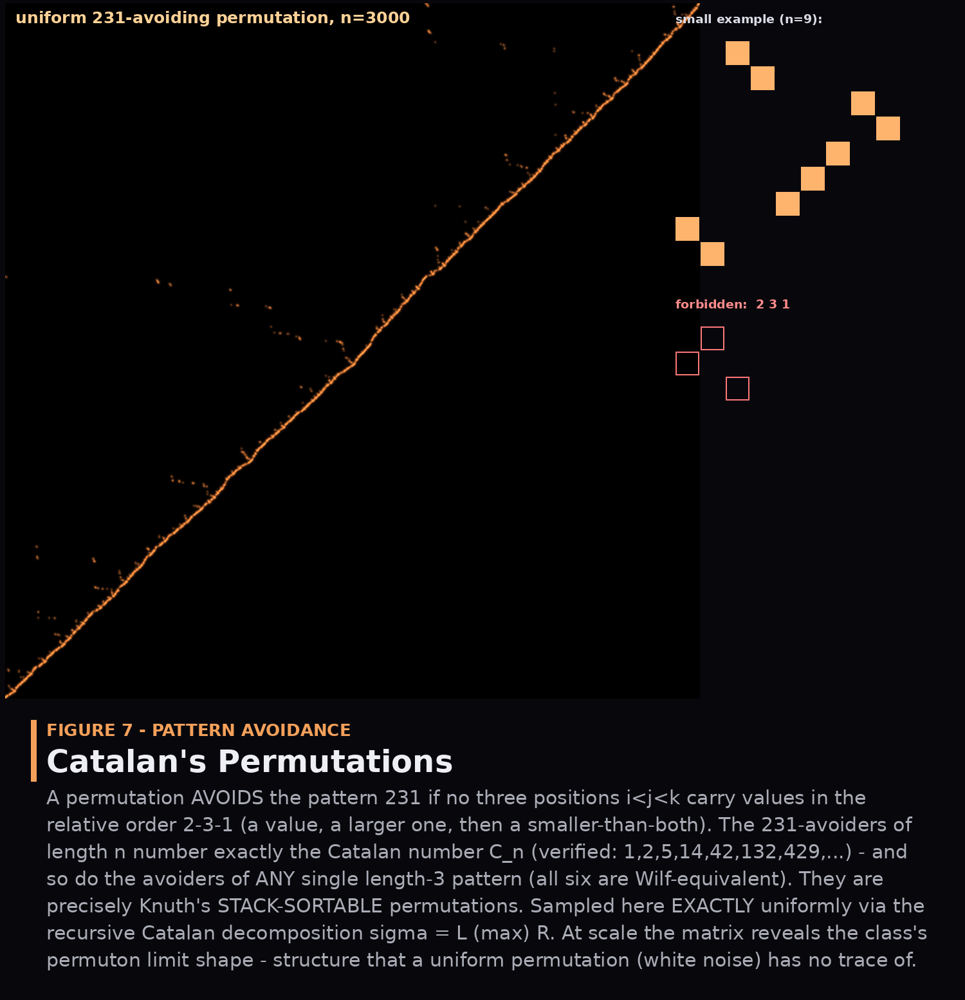

A permutation **avoids the pattern 231** if no three positions carry values in the
relative order 2-3-1. These are exactly Knuth's **stack-sortable** permutations,
and they number the **Catalan** number `Cₙ` (verified: 1, 2, 5, 14, 42, 132, 429,
…) — as do the avoiders of any single length-3 pattern (all six are
Wilf-equivalent). Sampled here *exactly uniformly* via the recursive Catalan
decomposition `σ = L · max · R`; at scale the matrix reveals the class's **permuton
limit shape** — a Brownian-wandering diagonal — structure that a uniform
permutation (white noise) has no trace of.

## 8 · The Eulerian Triangle
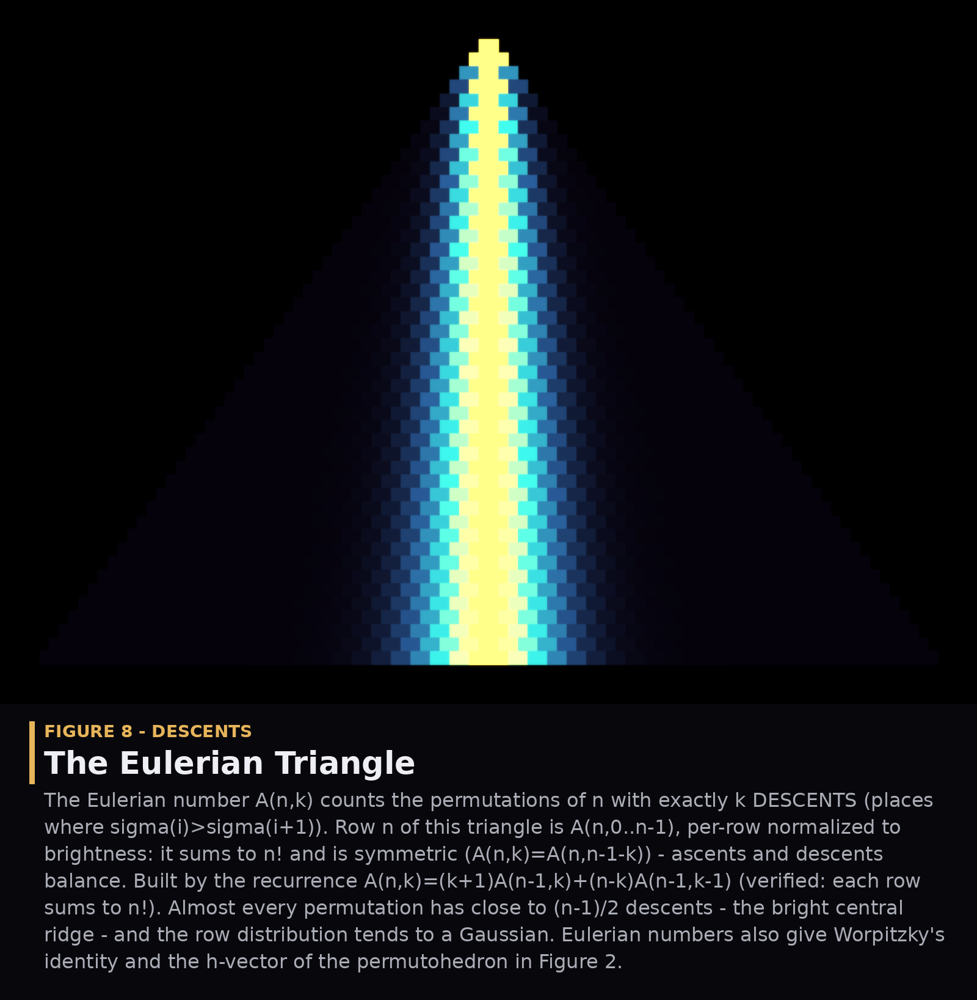

The **Eulerian number** `A(n,k)` counts permutations of `n` with exactly `k`
**descents** (`σ(i) > σ(i+1)`). Each row, per-row-normalised to brightness, sums
to `n!` and is symmetric — ascents and descents balance — and concentrates on a
bright central ridge at `k ≈ (n-1)/2` (built by the recurrence
`A(n,k)=(k+1)A(n-1,k)+(n-k)A(n-1,k-1)`, verified). Eulerian numbers also yield
Worpitzky's identity and the `h`-vector of the permutohedron in Figure 2.

---

# Volume III — permutations as light, water, and a lattice

## 9 · RSK, Cast as Shadows
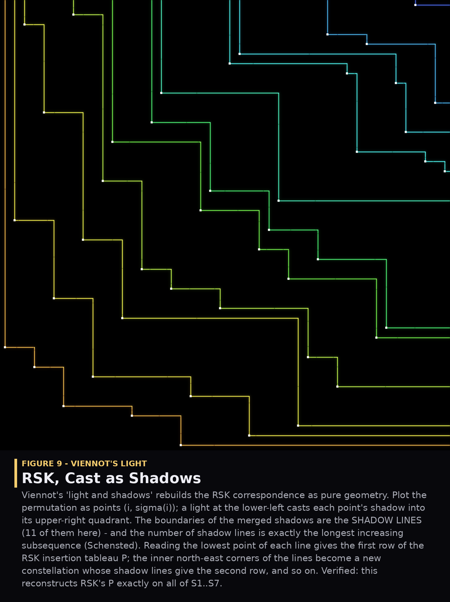

**Viennot's "light and shadows"** rebuilds the entire RSK correspondence from pure
geometry. Plot the permutation as points `(i, σ(i))`; a light at the lower-left
casts each point's shadow into its upper-right quadrant, and the boundaries of the
merged shadows are the **shadow lines** (the nested rainbow staircases). The number
of shadow lines is exactly the **longest increasing subsequence**; the lowest point
of each line gives the first row of the RSK tableau `P`, and the inner north-east
corners of the lines form a new constellation whose shadow lines give the next row,
and so on. Verified: this reconstructs RSK's `P` *exactly* on all of S₁–S₇.

## 10 · Paths That May Never Touch
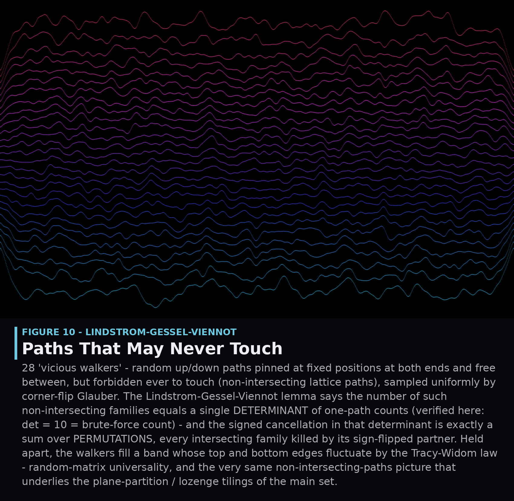

A family of **non-intersecting lattice paths** ("vicious walkers"): random up/down
paths pinned at both ends and forbidden ever to touch, sampled uniformly by
corner-flip Glauber. The **Lindström–Gessel–Viennot lemma** says the number of such
families equals a single **determinant** of one-path counts (verified: det = 10 =
brute-force count) — and the signed cancellation in that determinant is precisely a
sum over **permutations**, every intersecting family annihilated by its
sign-flipped partner. The band's edges fluctuate by the Tracy–Widom law — the same
random-matrix universality, and the same non-intersecting-paths picture that
underlies the plane-partition / lozenge tilings of the main set.

## 11 · The Other Order on the Symmetric Group
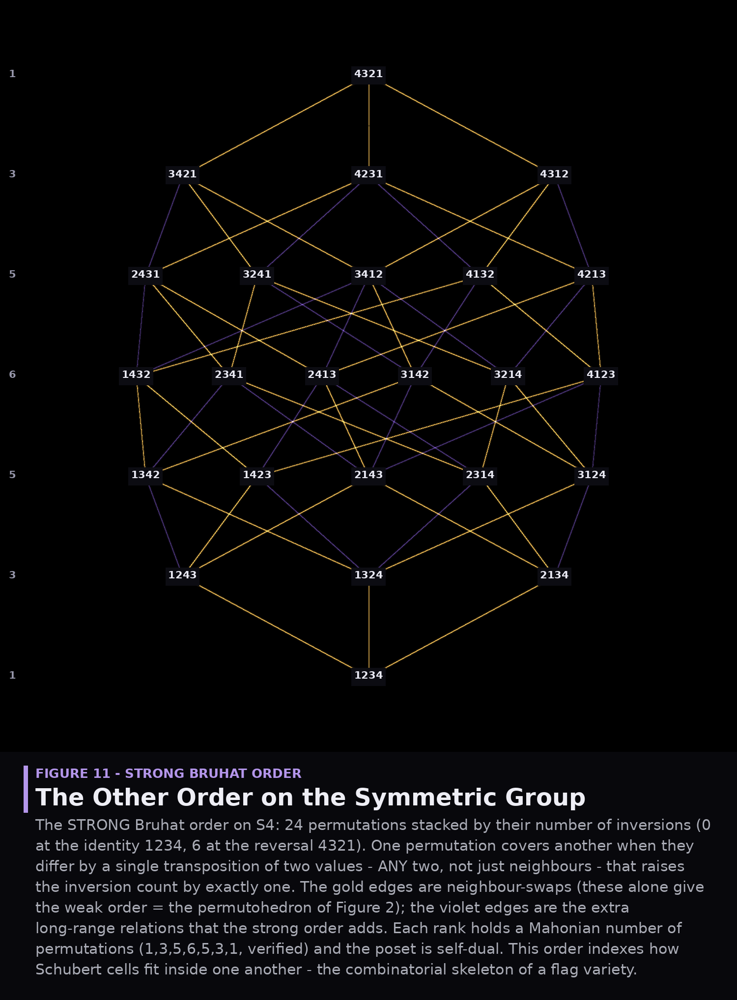

The **strong Bruhat order** on `S₄`: the 24 permutations stacked by inversion count
(identity `1234` at the bottom, reversal `4321` at the top). One permutation covers
another when a single transposition of two values — *any* two, not just neighbours
— raises the inversion count by one. **Gold** edges are neighbour-swaps (these
alone give the weak order, i.e. the permutohedron of Figure 2); **violet** edges
are the long-range relations the strong order adds. Each rank holds a Mahonian
number of permutations (`1,3,5,6,5,3,1`, verified) and the poset is self-dual. This
order is the combinatorial skeleton of a flag variety — it records how Schubert
cells nest inside one another.

---

# Volume IV — the sphere, the lattice of shapes, and one step beyond

## 12 · A Shuffle Is the Shadow of a Sphere
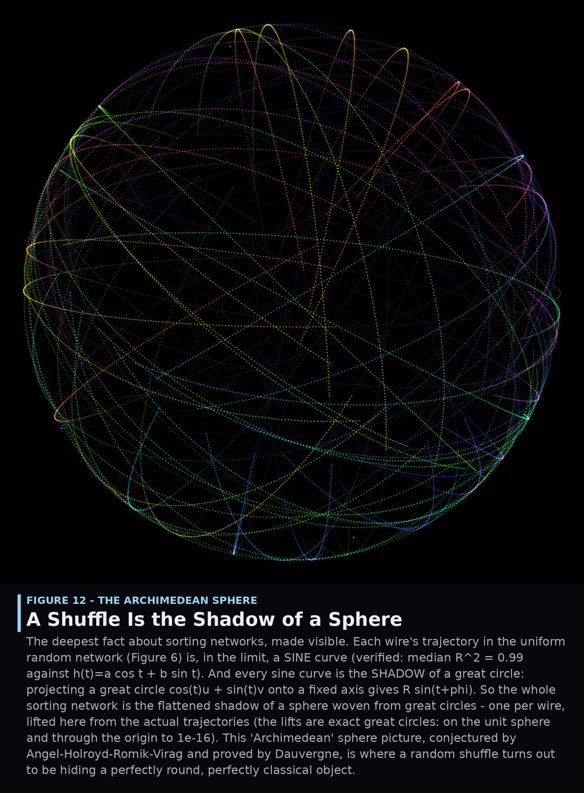

The deepest fact about sorting networks, made visible. Each wire's trajectory in
the uniform network (Figure 6) converges to a **sine curve** (verified: median
`R² = 0.99` against `h(t) = a cos t + b sin t`), and *every* sine curve is the
shadow of a **great circle** — projecting `cos(t)·u + sin(t)·v` onto a fixed axis
gives `R·sin(t+φ)`. So the whole random shuffle is the flattened shadow of a
sphere woven from great circles, one per wire, **lifted here from the actual
trajectories** (the lifts are exact great circles — on the unit sphere and through
the origin to `1e-16`). This "Archimedean" sphere, conjectured by
Angel–Holroyd–Romik–Virág and proved by Dauvergne, is where a random shuffle turns
out to be hiding a perfectly round, perfectly classical object.

## 13 · RSK as a Lattice of Shapes
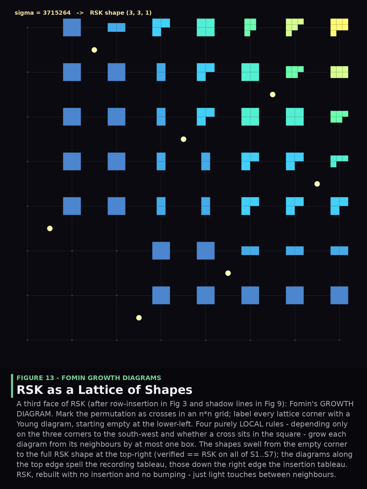

A third face of RSK, after row-insertion (Figure 3) and shadow lines (Figure 9):
**Fomin's growth diagrams**. Mark the permutation as crosses in a grid and label
every lattice corner with a Young diagram, empty at the lower-left. Four purely
**local rules** — depending only on the three corners to the south-west and
whether a cross sits in the square — grow each diagram from its neighbours by at
most one box. The shapes swell to the full RSK shape at the top-right (verified ==
RSK on all of S₁–S₇); the top edge spells the recording tableau, the right edge
the insertion tableau. RSK with no insertion and no bumping — just light touches
between neighbours.

## 14 · Signed Permutations: One Coxeter Step Further
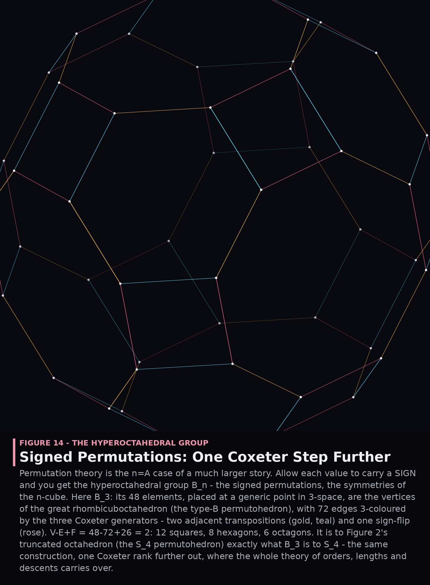

Permutation theory is the *type-A* case of a far larger story. Let each value
carry a **sign** and you get the **hyperoctahedral group** `B₃` — the signed
permutations, the symmetries of the cube. Its 48 elements, placed at a generic
point in 3-space, are the vertices of the **great rhombicuboctahedron** (the
type-B permutohedron); its 72 edges are 3-coloured by the three Coxeter generators
— two adjacent transpositions and one sign-flip. `V−E+F = 48−72+26 = 2` (12
squares, 8 hexagons, 6 octagons). It is to Figure 2's truncated octahedron exactly
what `B₃` is to `S₄` — the same construction, one Coxeter rank further out, where
the whole theory of lengths, orders and descents carries over intact.

---

# Volume V — representation theory, the lattice of shapes, and the plactic algebra

## 15 · The Character Table of the Symmetric Group
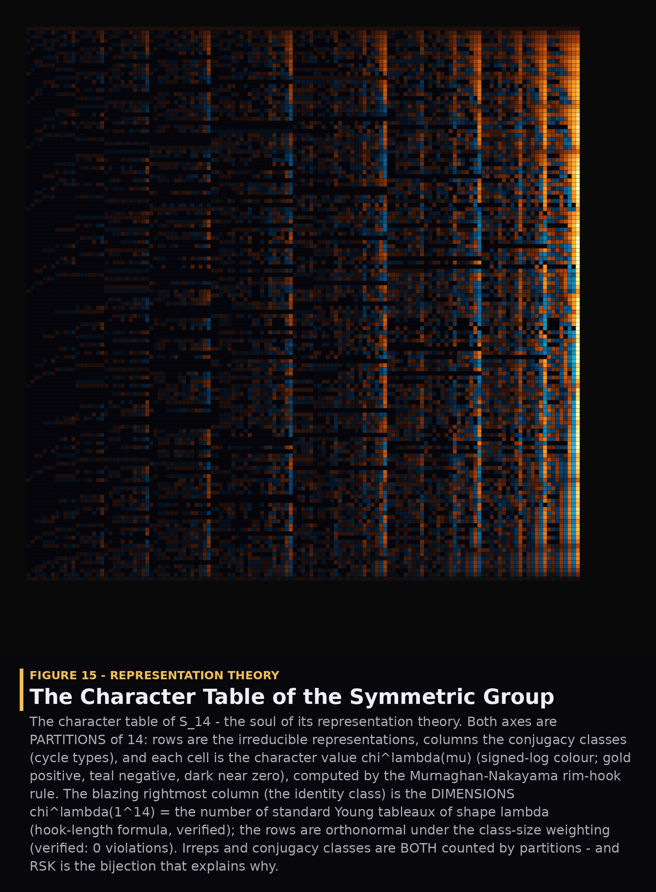

The soul of the representation theory of `Sₙ`, here for `n = 14`. Both axes are
**partitions** of 14: rows are the irreducible representations, columns the
conjugacy classes, each cell the character value `χ^λ(μ)` (signed-log colour),
computed by the **Murnaghan–Nakayama** rim-hook rule. The blazing column on the
right (the identity class) is the **dimensions** `χ^λ(1ⁿ)` = the number of
standard Young tableaux of shape `λ` (hook-length formula, **verified**); the rows
are orthonormal under the class-size weighting (**0 violations**). Irreducibles
*and* conjugacy classes are both counted by partitions — and RSK is the bijection
that explains why.

## 16 · The Tree of All Shapes — Young's Lattice
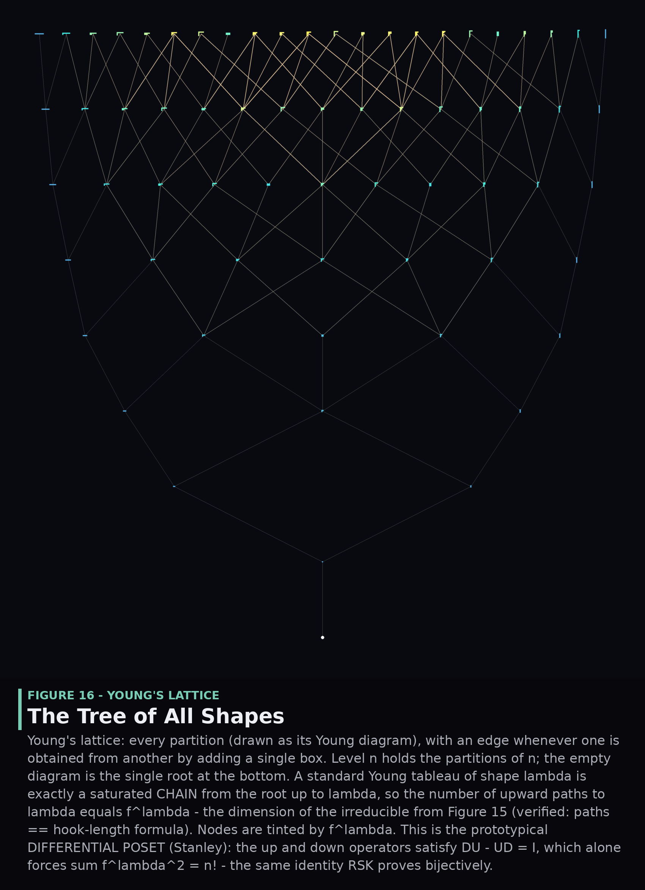

Every partition, drawn as its Young diagram, with an edge whenever one is obtained
from another by adding a single box — rising from the empty diagram at the root.
A **standard Young tableau** of shape `λ` is exactly a saturated chain from the
root up to `λ`, so the number of upward paths to `λ` equals `f^λ`, the dimension
from Figure 15 (**verified: paths == hook-length formula**); nodes are tinted by
`f^λ`. This is the prototypical **differential poset**: the up/down operators obey
`DU − UD = I`, which alone forces `Σ (f^λ)² = n!` — the identity RSK proves
bijectively.

## 17 · The Sliding Game Behind RSK — Jeu de Taquin
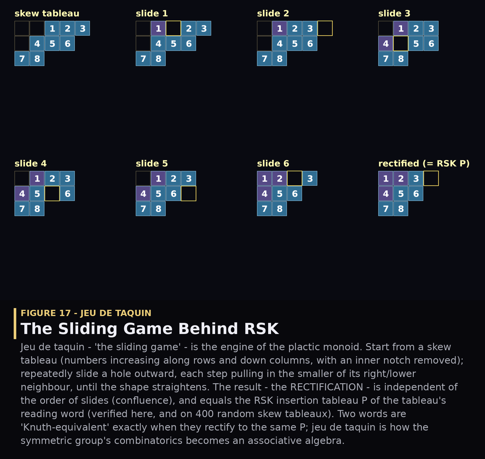

**Jeu de taquin**, the engine of the plactic monoid. From a skew tableau, slide a
hole outward — each step pulling in the smaller of its right/lower neighbour —
until the shape straightens. The result, the **rectification**, is independent of
the order of slides (confluence) and equals the **RSK insertion tableau** of the
reading word (verified here and on 400 random skew tableaux). Two words are
*Knuth-equivalent* exactly when they rectify to the same tableau — this is how the
symmetric group's combinatorics becomes an associative algebra.

## 18 · Two Statistics, One Distribution — Foata's Bijection
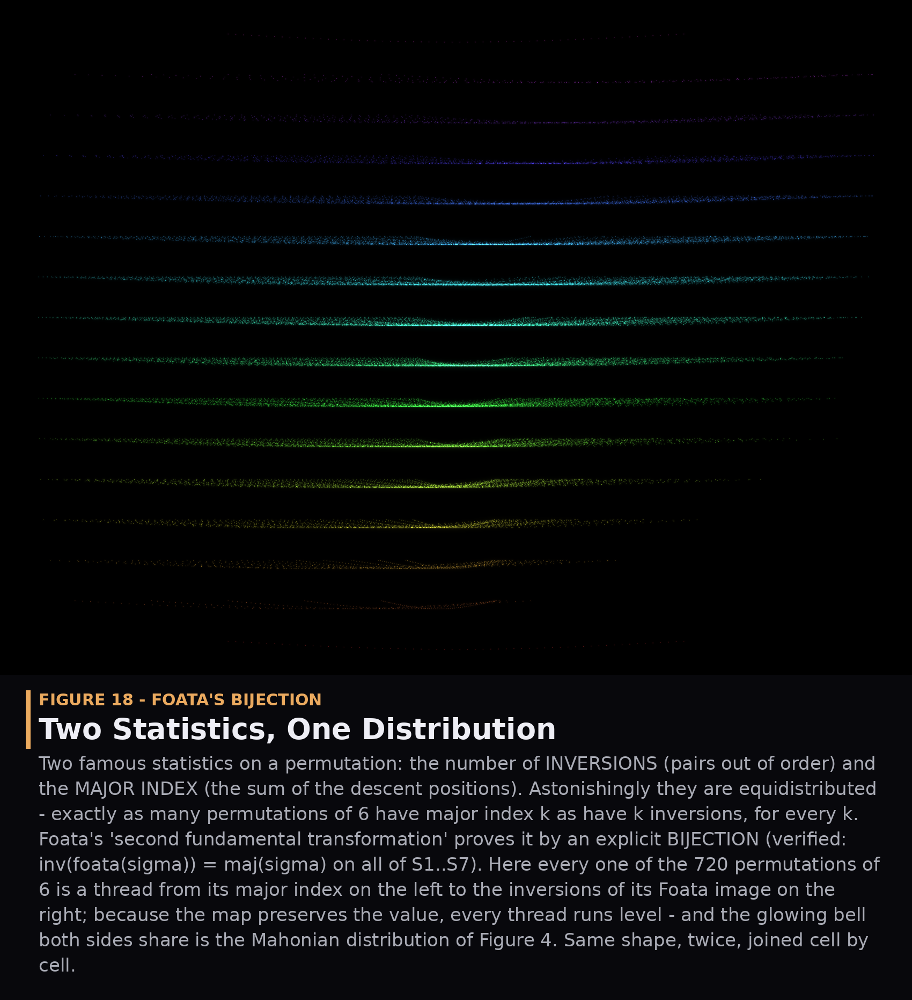

A permutation's **inversions** (pairs out of order) and its **major index** (the
sum of its descent positions) are *equidistributed* — exactly as many permutations
have major index `k` as have `k` inversions. **Foata's second fundamental
transformation** proves it by an explicit bijection (**verified:
`inv(foata(σ)) = maj(σ)` on all of S₁–S₇**). Each of the 720 permutations of 6 is
a thread from its major index (left) to the inversions of its Foata image (right);
because the map preserves the value every thread runs level, and the glowing bell
both sides share is the Mahonian distribution of Figure 4 — the same shape, twice,
joined cell by cell.

---

# Volume VI — plumbing, associativity, and a clock on tableaux

## 19 · A Permutation as Plumbing — Pipe Dreams
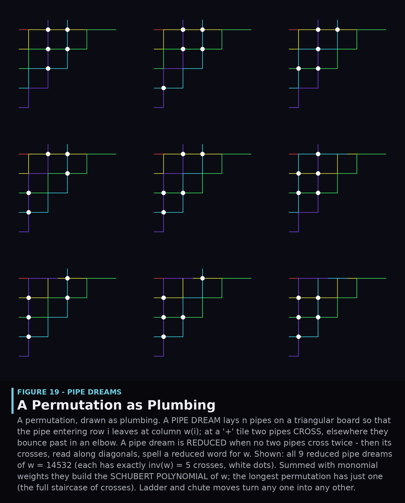

A **pipe dream** (RC-graph) lays `n` pipes on a triangular board so that the pipe
entering row `i` leaves at column `w(i)`; at a `+` tile two pipes cross, elsewhere
they bounce past in an elbow. A pipe dream is **reduced** when no two pipes cross
twice — and then its crosses, read along diagonals, spell a reduced word for `w`.
Shown are all **9** reduced pipe dreams of `w = 14532` (each with exactly
`inv(w) = 5` crosses). Summed with monomial weights they build the **Schubert
polynomial** of `w`; the longest permutation has just one (the full staircase),
and *ladder/chute moves* turn any pipe dream into any other. (Verified: `w₀` has a
unique pipe dream, for `n = 3,4,5`.)

## 20 · The Shape of Associativity — Associahedron & Tamari
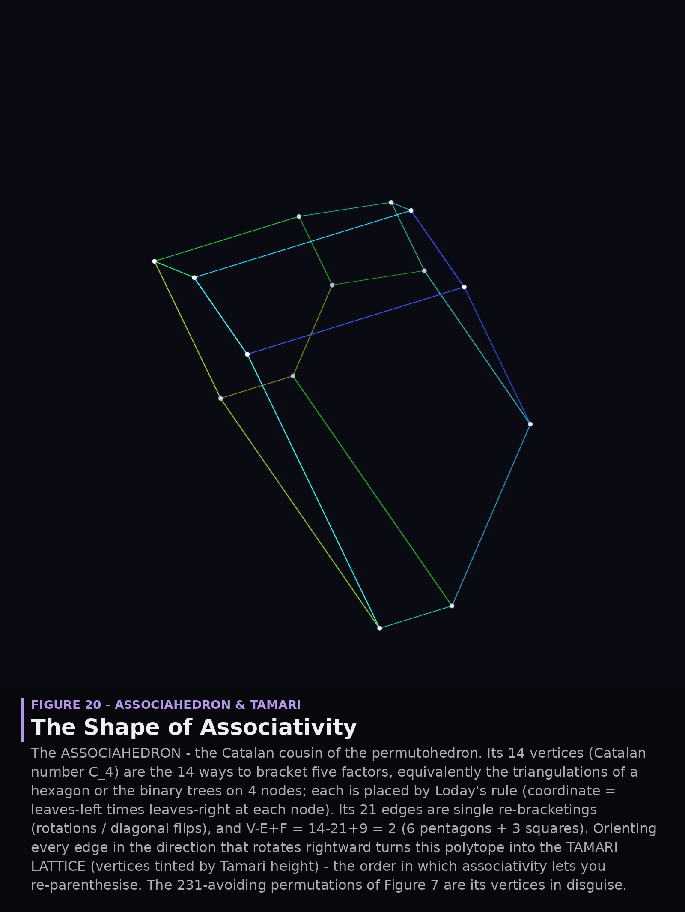

The **associahedron**, the Catalan cousin of the permutohedron. Its **14** vertices
(Catalan `C₄`) are the ways to bracket five factors — triangulations of a hexagon,
binary trees on 4 nodes — each placed by **Loday's** rule; its **21** edges are
single re-bracketings (rotations), and `V−E+F = 14−21+9 = 2` (6 pentagons +
3 squares, verified). Orienting each edge in the rightward-rotation direction turns
the polytope into the **Tamari lattice** (vertices tinted by Tamari height). The
231-avoiding permutations of Figure 7 are these vertices in disguise.

## 21 · A Clock on Tableaux — Promotion & Cyclic Sieving
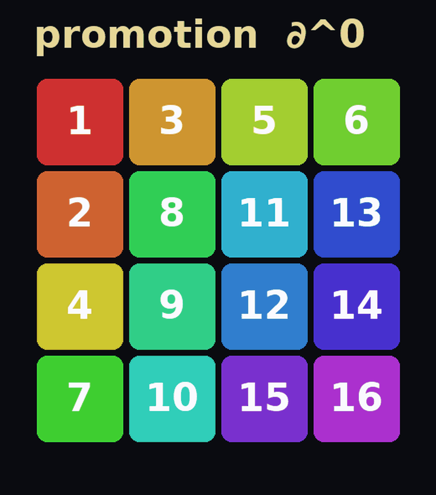

**Schützenberger promotion**, animated (montage above; `21_promotion.gif` is the
loop). Delete the `1` from a standard Young tableau, slide the hole out by jeu de
taquin, subtract 1 from every entry, and drop `n` into the vacated corner — one
tick of a clock on tableaux. On a rectangle it has finite order: here the **16-step
orbit** of a 4×4 tableau returns exactly to the start (verified). The orbit sizes
obey the **cyclic sieving phenomenon** of Reiner–Stanton–White — substitute a root
of unity into the `q`-analogue of the hook-length formula and you read off exactly
how many tableaux each rotation fixes.

---

### Honest math, first
Every figure is checked in code before it is drawn: cycle statistics against `Hₙ`
and Golomb–Dickman; the permutohedron's vertex/edge/face counts; RSK and the
Edelman–Greene bijection by exhaustive round-trip; Viennot's shadow lines against
RSK on all of S₁–S₇; the LGV determinant against a brute-force family count; the
Bruhat rank sizes against the Mahonian numbers; the great-circle lifts for
sphere/planarity plus the trajectory sine fits; Fomin growth against RSK on all of
S₁–S₇; the type-B polytope's `V−E+F`; the character table's dimensions and
orthogonality; Young's-lattice path counts against `f^λ`; jeu-de-taquin
rectification against RSK; Foata's `inv∘foata = maj`; the pipe-dream model against
`w₀`; the associahedron's `V−E+F`; promotion's order on rectangles; and the
Mahonian, Mallows, Catalan and Eulerian counts against their closed forms. Where an honest sample was hard (the
sorting network), the work went into the *sampler* rather than into faking the
picture.
