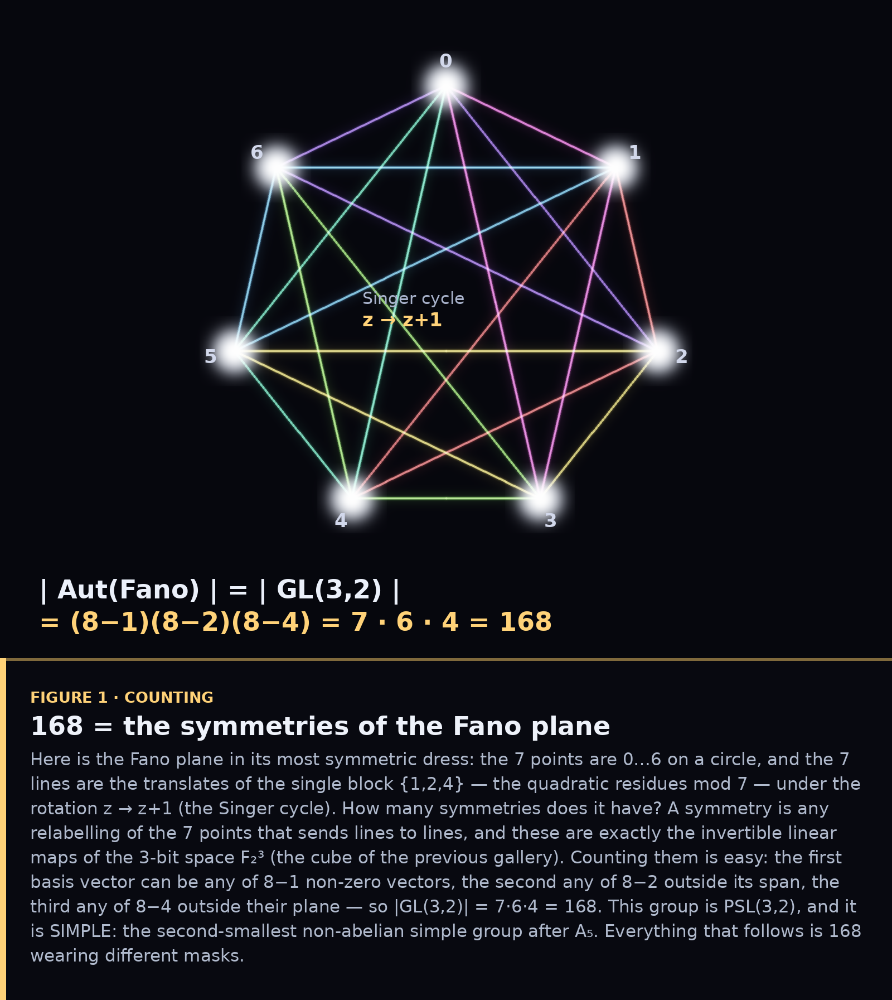
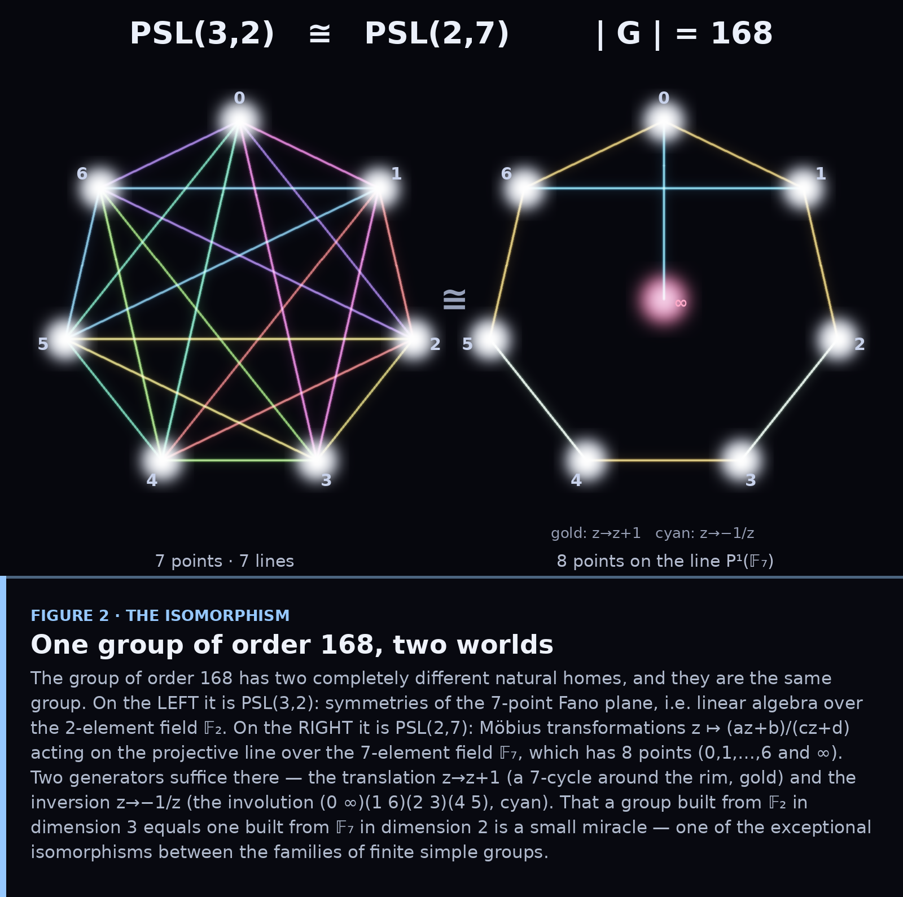
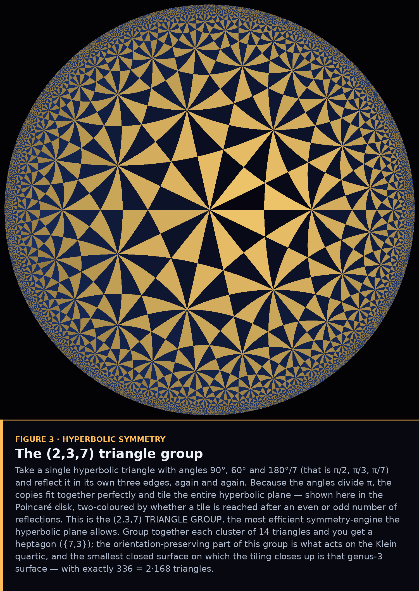
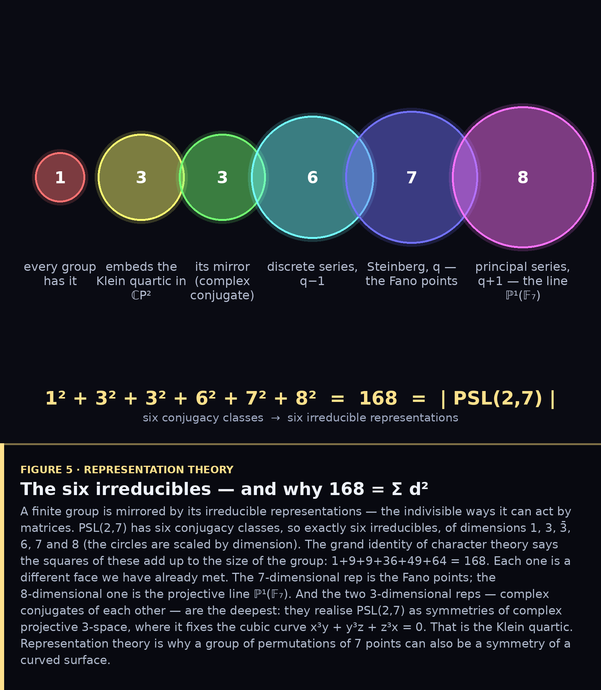
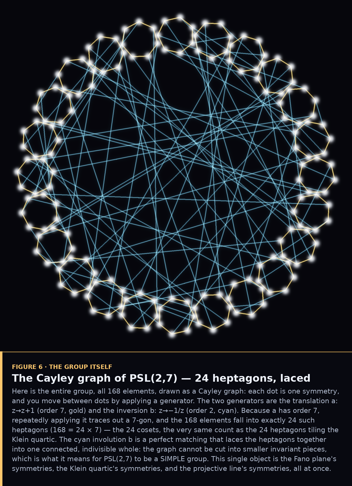
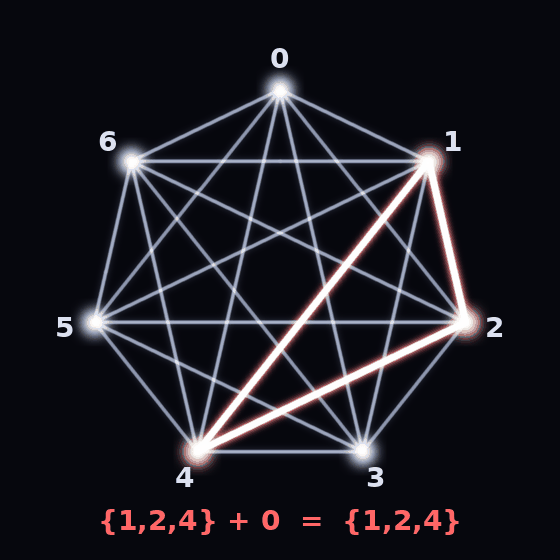

# The Order of 168 — PSL(2,7) and the Klein Quartic

*The Fano plane's hidden symmetry, the second-smallest simple group, and the
most symmetric surface of its kind.*

In the previous gallery the Fano plane was the multiplication table of the
octonions. Now we ask a different question: **what are its symmetries?** The
answer is a single group of order **168** — and it turns out to be one of the
most remarkable objects in mathematics, appearing under at least four disguises:
as the linear maps of a 3-bit space, as Möbius transformations over the field of
7 elements, as the rotations of a genus-3 surface, and as the
second-smallest non-abelian *simple* group. This is a tour of those disguises,
each figure carrying its own annotation block, all built on verified arithmetic
(`p168.py`).

---

## 1. Where 168 comes from

Draw the Fano plane at its most symmetric: 7 points on a circle, the 7 lines all
rotations of the single block {1,2,4} (the quadratic residues mod 7). A symmetry
is a relabelling that preserves lines — exactly an invertible linear map of the
3-bit space 𝔽₂³ — and counting them is a single line of arithmetic:
**(8−1)(8−2)(8−4) = 7·6·4 = 168**. The group is PSL(3,2), and it is *simple*.

## 2. One group, two worlds

The miracle is that this group has a second, totally different home. On the left
it is **PSL(3,2)**: symmetries of the 7-point Fano plane, built from the
2-element field. On the right it is **PSL(2,7)**: Möbius maps z ↦ (az+b)/(cz+d)
on the projective line over the 7-element field, which has 8 points. A group of
linear algebra over 𝔽₂ in 3 dimensions equals a group of fractional-linear maps
over 𝔽₇ in 2 dimensions — an *exceptional isomorphism*, a coincidence the
classification of finite simple groups permits only a handful of times.

## 3. The kaleidoscope behind it

To find this group in geometry, start with a single hyperbolic triangle of
angles π/2, π/3, π/7 and reflect it endlessly in its own edges. The copies tile
the hyperbolic plane — the **(2,3,7) triangle group**, the most efficient
symmetry engine curved space allows. Bundle 14 triangles and you get a heptagon;
the orientation-preserving part of this group is what will act on the Klein
quartic.

## 4. The Klein quartic

Those heptagons tile the surface of the **Klein quartic**, the curve
x³y + y³z + z³x = 0 — the most symmetric surface of genus 3. The tiling runs
forever in the disk, but on the quartic it closes up after exactly **24
heptagons** (56 vertices, 84 edges, Euler characteristic −4 = 2−2·3). Its
rotational symmetry group has order 168, and that is the maximum *any* genus-3
surface can have: Hurwitz proved the ceiling is 84(g−1), and 84·2 = 168 hits it
exactly. PSL(2,7) is the symmetry of the most symmetric surface there can be.

## 5. Why a permutation group lives on a curved surface

How can a group of permutations of 7 points also be the symmetry of a *surface*?
Representation theory answers it. PSL(2,7) has six irreducible representations,
of dimensions 1, 3, 3̄, 6, 7, 8 — and the squares add up to the size of the
group, **1+9+9+36+49+64 = 168**. The 7 is the Fano points; the 8 is the
projective line; and the two 3-dimensional reps realise the group inside complex
projective space, where it fixes exactly the cubic x³y+y³z+z³x. That is *why*
the Klein quartic exists.

## 6. The whole group at once

Finally, the group as a single object. Every dot is one of the 168 symmetries;
edges apply a generator — the order-7 translation a (gold) and the order-2
inversion b (cyan). The order-7 generator carves the elements into **24
heptagons** (168 = 24 × 7, the same 24 as the Klein quartic's tiles), and the
involution laces them into one inseparable web. That inseparability is exactly
what *simple* means: the group has no non-trivial normal subgroups, no way to
break it into smaller pieces.

## The Singer cycle (animation)

A closing motion: the seven lines of the Fano plane are not seven separate facts.
They are a *single* block — {1,2,4}, the quadratic residues mod 7 — swept around
by the rotation z → z+1. Watch one triangle hop through all seven positions and
generate the entire plane. That single cyclic symmetry is the seed of everything
above.

---

## The shape of the whole thing

168 = 2³·3·7 is small enough to hold in your hand and rich enough to be the
symmetry of four different worlds: a finite geometry (the Fano plane), a finite
field's projective line (𝔽₇), a Riemann surface (the Klein quartic), and an
abstract simple group. The Fano plane connected the octonions to triality in the
last gallery; here the *same seven points*, asked only "what are your
symmetries?", open a door onto hyperbolic geometry, Riemann surfaces, and the
classification of simple groups. Seven points have never done so much work.

### Files
`p168.py` — verified group facts (|GL(3,2)|=168, |PSL(2,7)|=168, Singer set,
hyperbolic helpers) · `fig1`–`fig6_*.py`, `anim_singer.py` — one script per
figure · figures reuse the annotation-block compositor from `../octonions/figkit.py`.
