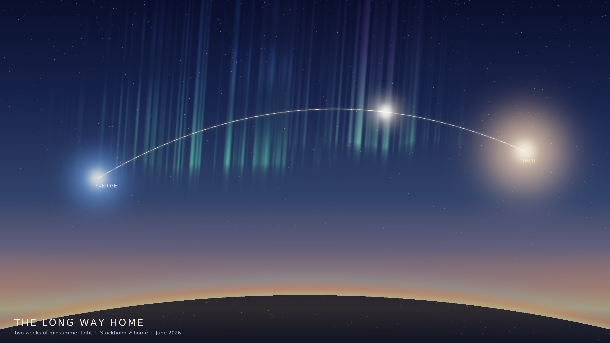

# The Long Way Home

A procedural keepsake for Edward's flight home from Sweden — after two weeks of
midsummer light, June 2026.

It's a view from altitude in the long Nordic dusk (in late June the sun only
grazes the horizon — hence the gold band that never quite goes out). The curve of
the Earth carries its thin atmosphere; aurora curtains rise green into violet;
and a great-circle thread of light runs from **Sverige** (the blue-and-gold glow,
behind you now) toward **hem** — home, the warm light ahead. The bright spark
on the arc is *you, right now,* most of the way across.

Everything is generated in `scene.py` (NumPy + Pillow): the sky and atmosphere
are layered gradients, the aurora is blurred noise shaped into rising rays, the
stars are a power-law scatter, and the flight path is a Bézier arc rendered as an
additive glow. Welcome home. 🛬

*Run:* `python3 scene.py 2560 1440 7 the_long_way_home.png`
