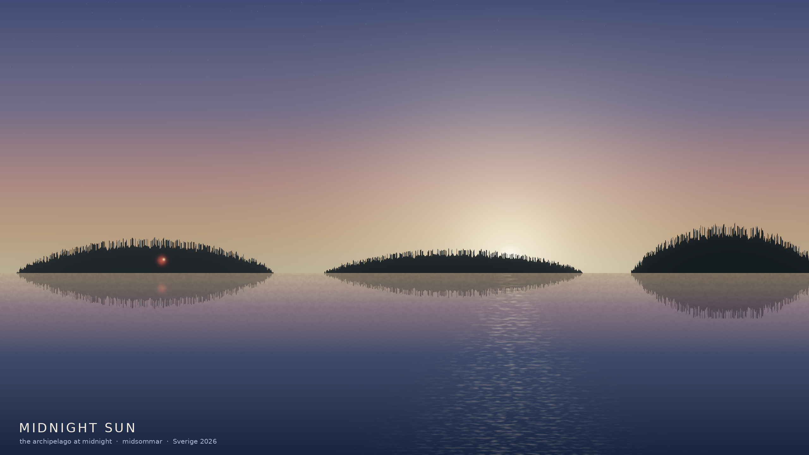
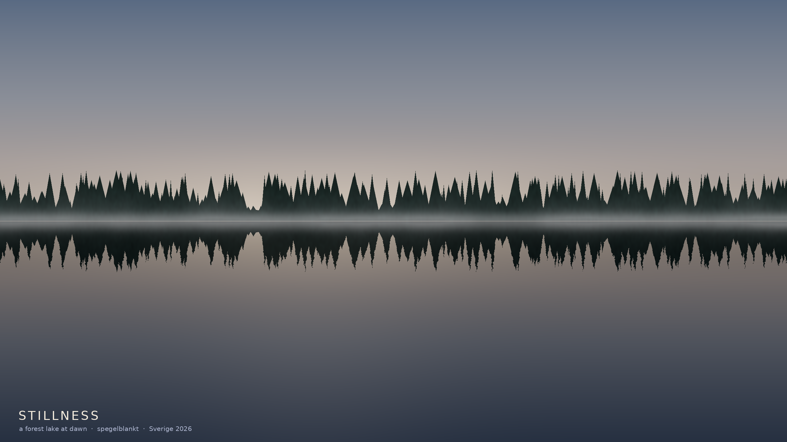
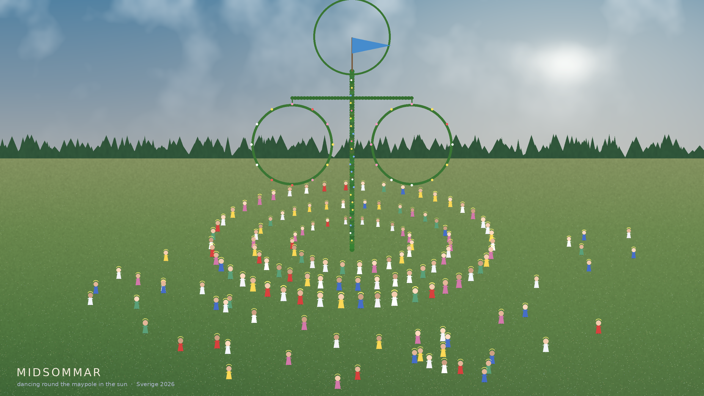
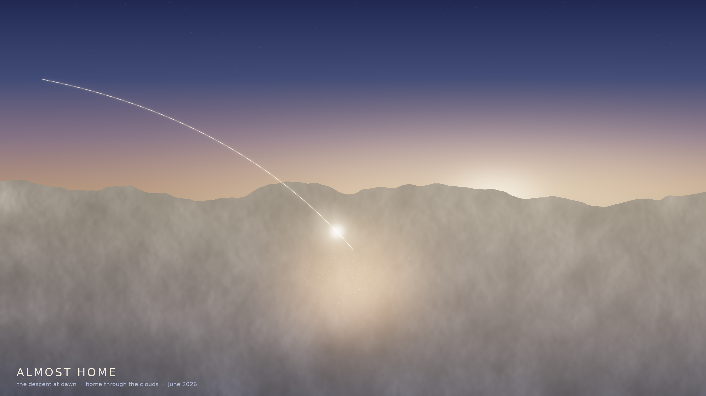

# Sweden — a small series

Procedural keepsakes for Edward's two weeks of midsummer light in Sweden and the
flight home, June 2026. Everything is generated with NumPy + Pillow (layered
gradients, value/fractal noise, additive glow); shared helpers live in `vista.py`.

### 1. The Long Way Home — `the_long_way_home.py`

A view from altitude in the long Nordic dusk: the curve of the Earth and its thin
atmosphere, aurora rising green into violet, and a great-circle thread of light
from **Sverige** (behind you) to **hem** — home, the warm glow ahead. The bright
spark on the arc is you, mid-flight.

### 2. Midnight Sun — `midnight_sun.py`

The low golden sun over the Stockholm *skärgård*: glass-calm Baltic water with a
shimmering sun-glitter path, low islands with a pine tree-line, and a single
**Falu-red cottage** glowing on the shore, under the pale midsummer-night sky.

### 3. Stillness — `forest_lake.py`

A forest lake at dawn — *spegelblankt*, mirror-calm. A dense spruce treeline
doubled in the still water, with low mist drifting at the waterline.

### 5. Midsommar — `midsommar.py`

The celebration in the sun: the leaf-and-flower maypole (*midsommarstång*) in a
flowering meadow, with rings of people dancing around it hand in hand, flower
crowns and summer dresses, a whole crowd gathered in the long bright day.

### 4. Almost Home — `almost_home.py`

The descent at dawn: a soft sea of clouds lit by a low sun, and the lights of
home glowing up through a thin patch as the flight path comes down to meet it.
A bookend to the first piece.

---
*Run e.g.:* `python3 midnight_sun.py 2560 1440 3 midnight_sun.png`

Välkommen hem. 🛬
